# 火柴人大战略 Stick World

> **横版策略战争游戏** —— 定居点建设 · 小队编成 · 大规模实时战斗 · 单兵附身微操
> **引擎 Godot 4.x · 平台 Windows · 单人独立开发 3 个月、1500+ 提交 · 目前还在高速迭代开发中**

<!-- TODO: 录制 1-2 分钟实机视频传 B 站后，在此处补链接 -->


## 🎮 下载游玩

**[下载 Windows 版 v0.4（点击跳转 Release）](https://github.com/fanboran/stickworld/releases/latest)** —— 解压后双击 `stick-world.exe`，无需安装（Windows 10/11 64 位）。

## 游戏实机画面

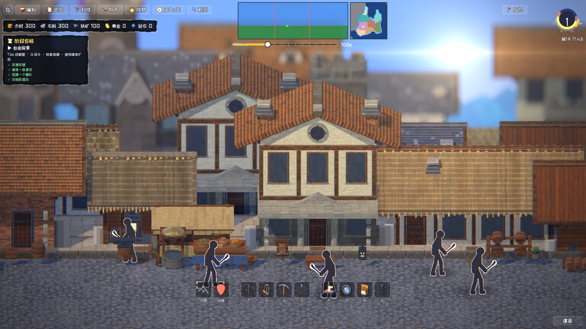

**战场与编队**

| | |
|---|---|
|  |  |
|  |  |

**程序化大陆战略图（Tab/M 随时打开）**

| | |
|---|---|
|  |  |

**界面与流程**

| | |
|---|---|
|  |  |
|  |  |

**自绘 UI 组件库（全 UI 手绘皮肤家族，`stick-world/tests/dev/ui_audit_capture.tscn` 一键复跑）**

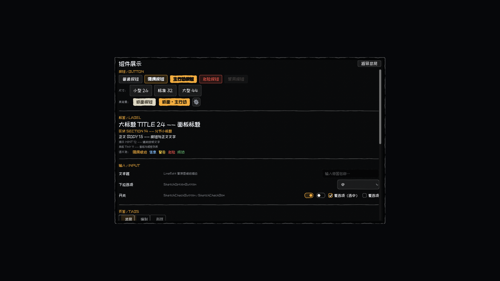

| | |
|---|---|
| 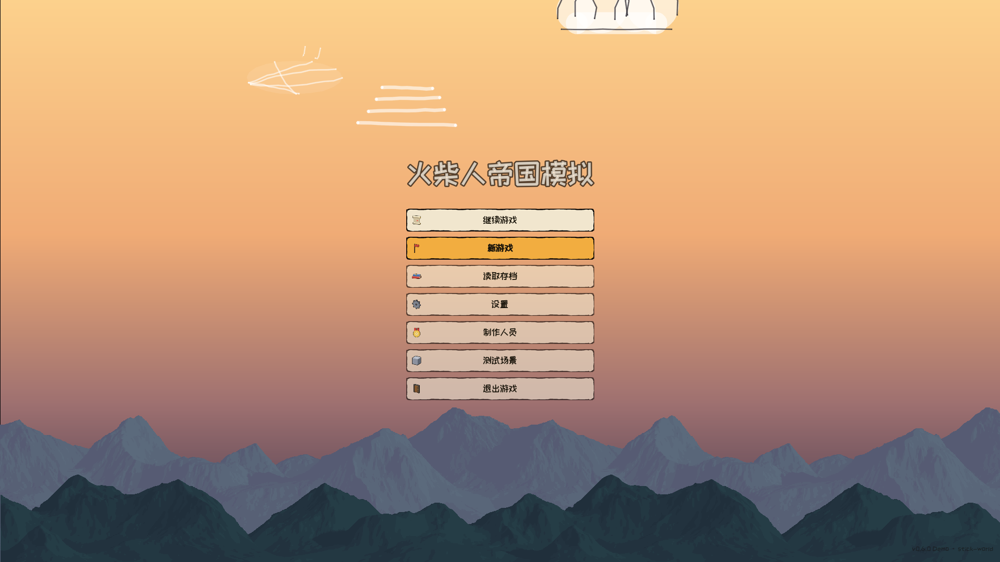 | 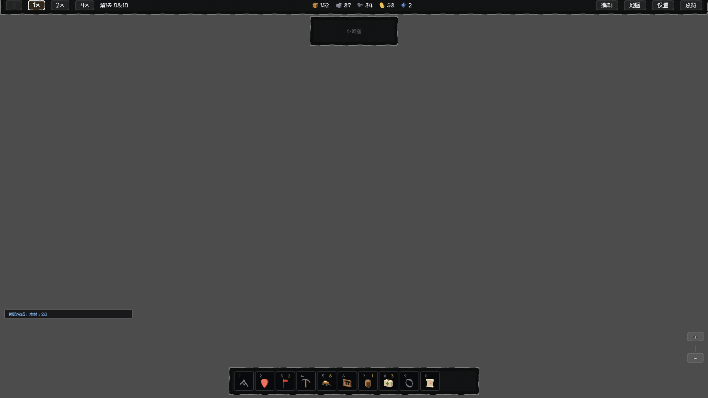 |
| 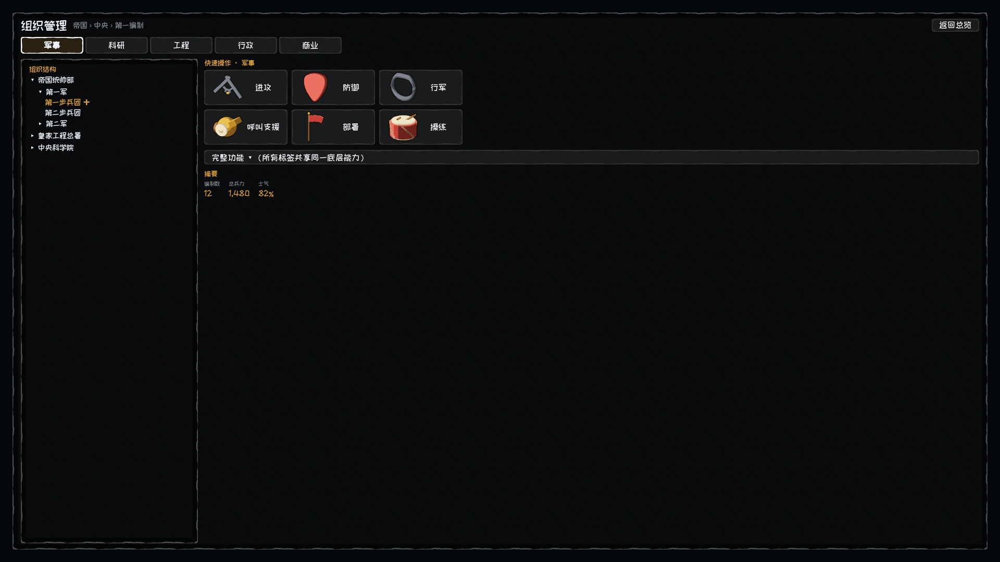 | 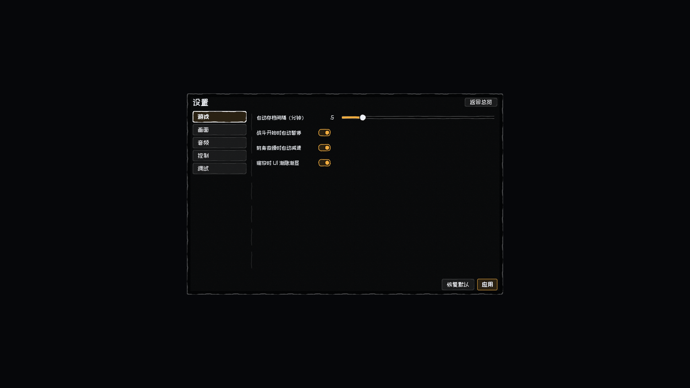 |

## 从新游戏到首胜（最快 10 分钟）

主菜单点「新游戏」，跟着右上角**阶段目标卡**走：**采集**（WASD 移动，靠近树木/岩石按 `E` 连采）→ **建造**（右下「建造」放建筑并施工）→ **编队**（顶栏「编制」创建编队，或 `Q` 框选士兵）→ **战斗**（带兵行军抵达战场，歼灭敌军）→ 胜利结算，开放自由沙盒（战略图 Tab/M、附身微操、跨图旅行、昼夜循环）。完整说明与按键表见[游戏演示页](docs/演示/游戏演示说明.md)。

| 操作 | 按键 |
|---|---|
| 移动 / 采集·交互（可按住连采） / 战斗模式 | `WASD` / `E` / `Q` |
| 换武器（剑矛弓镐杖） | `1-5` |
| 战略图（地块/大陆） | `Tab` / `M` |
| 附身微操 | BattlePanel「附身选中单位」 |
| 暂停·继续 / 菜单 / 存档 | `空格` / `ESC` / `F5·F9` |

## 玩法与系统

| 域 | 内容 |
|---|---|
| **实时战斗** | 兵种行为档案 AI——侧翼自动包抄、站桩微移、受击规避、风筝保距、攻击槽位排队；命令三级裁决（玩家 > 编队 > 单位本能）；近战在动画命中帧结算，箭矢带移动目标预判 |
| **大战略图** | 程序化世界生成（分形大陆、Delaunay 高度场、河流追踪）产出"大陆—地区—地块"三级地图，地形/政治双模式渲染，21 万顶点预烘焙至 0.6 秒首开 |
| **经济与建造** | 资源采集/建筑放置/施工/仓库区域账目，12 张 Excel 数值配置表为唯一数据源 |
| **附身微操** | 附身任意单位亲自参战，配合走位与攻击节奏 |
| **昼夜与天空** | Terraria 式日月运行、380 颗程序星野、月相盈亏、逐顶点 HSL 极光、流星；六层单 pass 后处理（暖色分级/太阳炫光/色差/胶片颗粒）随昼夜联动 |

## 渲染与美术管线

- **多层视差天空**：星野(0.08)→飞鸟(0.35)→远山(0.55)→树线/雾带(0.7-0.88)，Terraria 云池逆向（尺度=深度视差、风驱动、天空色继承）
- **程序化笔触贴图**：程序合成参考图 → 油画笔触算法拟合（StrokeGenerator：分层笔触+画布叠压）→ 形状 mask 抠图 → 游戏贴图（云/远山/树线均此管线产出）
- **程序化音频**：自研合成 BGM（Am-F-C-G 氛围 pad 无缝循环）、分层鸟鸣与雨声（FFT 周期化），生成器见 `tools/ai/gen_sfx.py`
- 参考游戏逆向笔记：[docs/技术/参考逆向/天空与水体逆向笔记.md](docs/技术/参考逆向/天空与水体逆向笔记.md)

## 美术资产画廊（建筑生成管线 v3）

> 建筑美术管线产物：**材质库 64 key · 建筑几何库 27 种装配器 · 道具 94 件 · 内景 29 def · 自然物 16 类 · 地面分段链（3 带 × 3 区带 × 5 变体）· 昼夜分层合成公式标定 · HD-2D 原型验证通过**。全流程为「代码建模 → Blender PBR 渲染 → PNG + JSON 元数据」，硬约束只有建筑宽度 3~16 格（1 格 = 32px ≈ 0.42m），视角为**纯正面 + 俯角 20° 微俯视**。下方为产物的压缩副本（长边 ≤1600px），全尺寸原图在 `stick-world/temp/`（gitignored）；管线规范见[建筑生成管线 v3](docs/技术/架构/建筑生成管线v3-写实PBR.md)。

**建筑几何与材质**

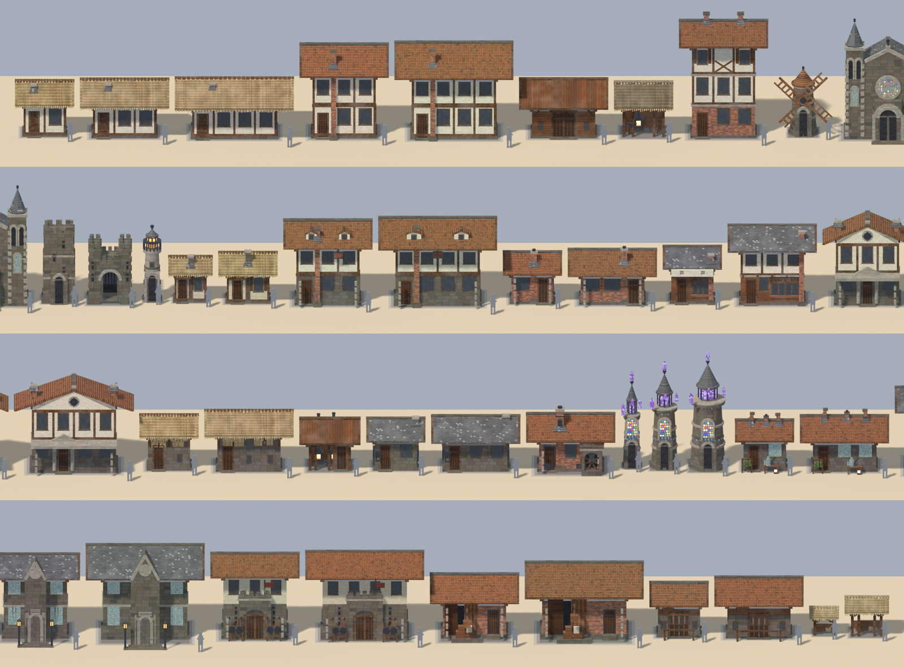
*27 种装配器总览 —— `buildings.py` 程序化建模，宽度取 4/8/12/16 格整数倍；含独立化的法师塔/炼金坊/图书馆/兵营/仓库/马厩/棚屋/干草棚，满图人物剪影为 1.70m 火柴人尺度参照*

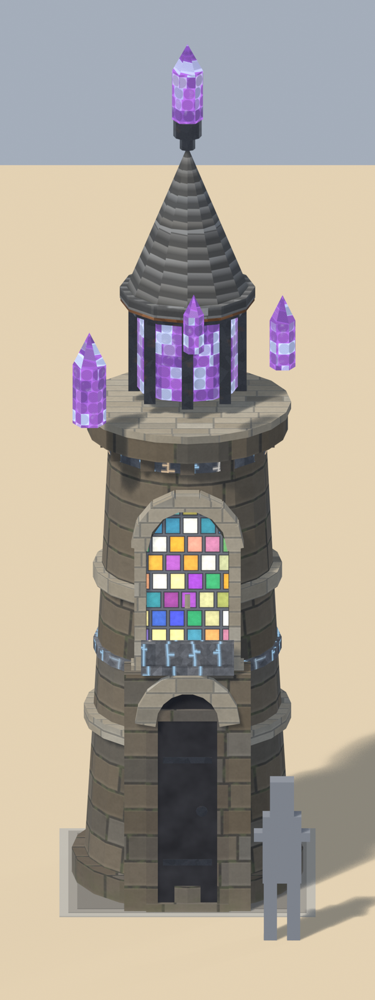
*法师塔单体特写 —— 塔身 2×3.66m、锥顶比 0.72；石板锥顶/石砌塔身/彩色玻璃窗/crystal 与 rune_glow 发光件同框，右下为 1.70m 火柴人对照*

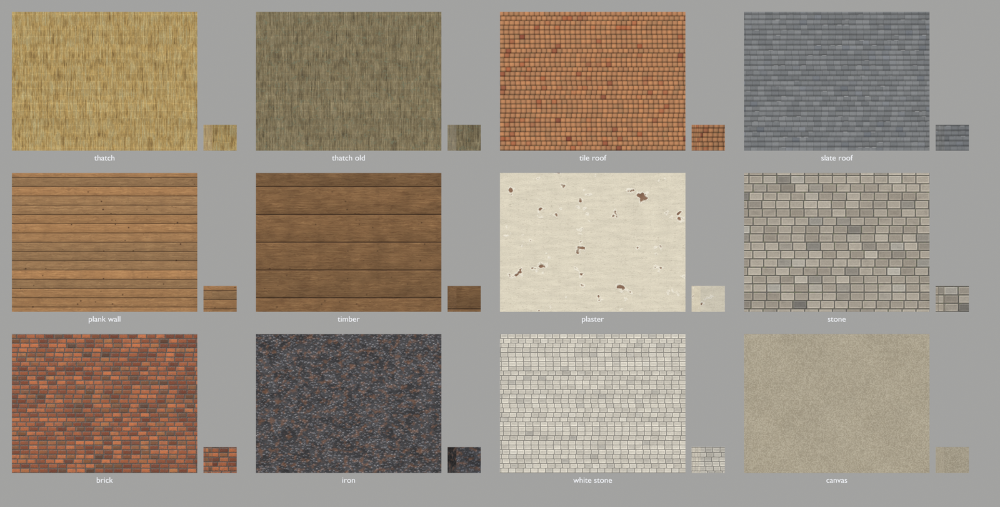
*材质库样片（64 key 中的 12 个代表）—— 茅草/瓦/石板/木板/粗木/灰泥/石/砖/铁/白石/帆布；每格右下角为 25% 游戏尺寸可读性门禁预览，做旧另设 13 个 AGE key*

**城市成图与比例审计**

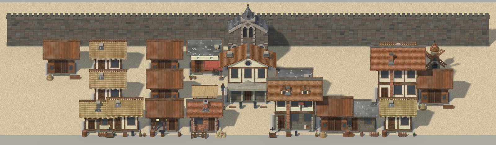
*城镇（town 档）街区俯视图 —— `city_layout.py` 四档确定性布局（hamlet/village/town/city）之一，前排街屋 + 高耸城墙背景 + 中心地标*

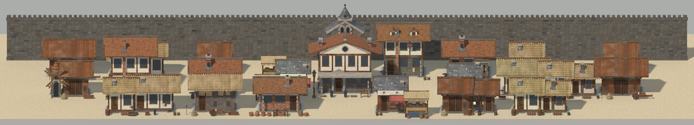
*城市（city 档）成图 —— 城墙体系 / 分区权重 / 天际线 / 广场由布局器产出，建筑为单排微俯视街景*

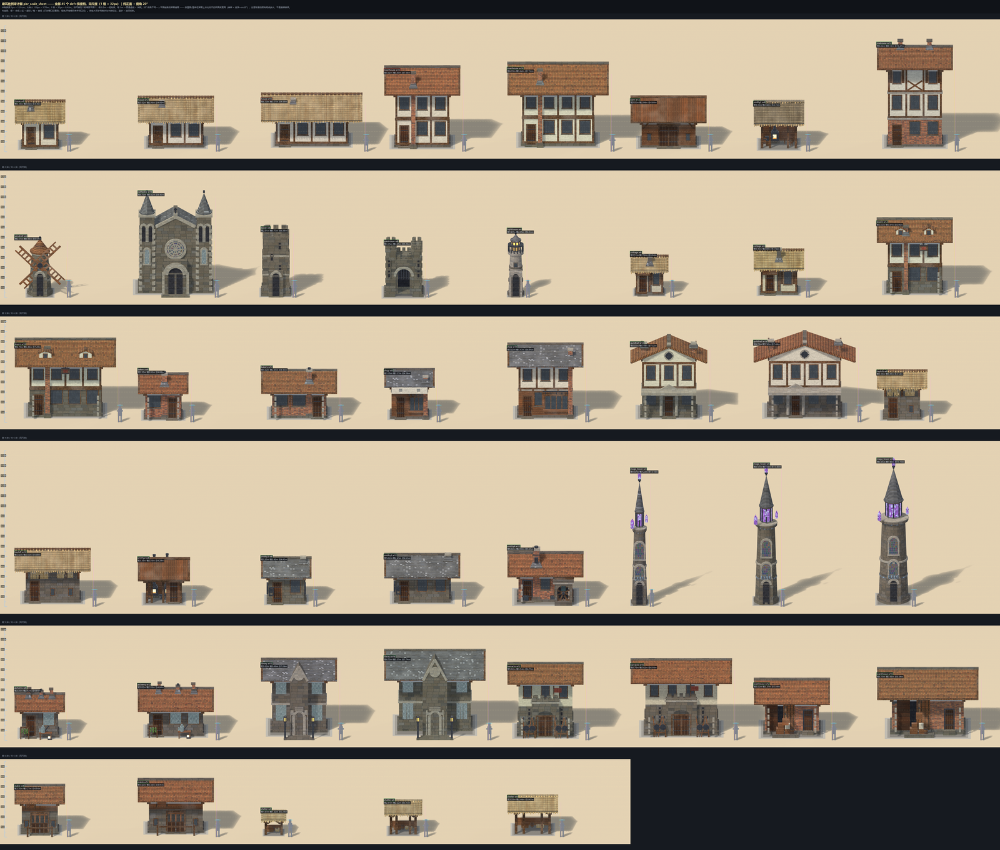
*比例审计总表 45 档 —— 每栋带 0.5m 刻度尺与偏差标注，按米制换算规范（1px≈1.31cm、1 格≈0.42m、层高 196~212px）逐栋复核*

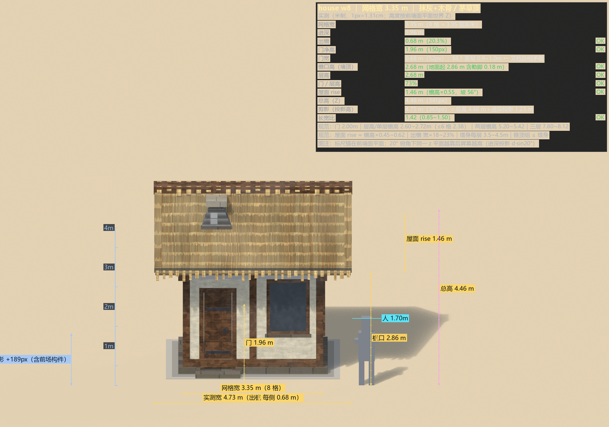
*单栋比例标注示例（house 8 格宽）—— 门 1.96m、檐口 2.86m、屋顶 rise 1.46m、总高 4.46m，右侧为 1.70m 火柴人对照*

**道具 · 内景 · 地面 · 自然物**

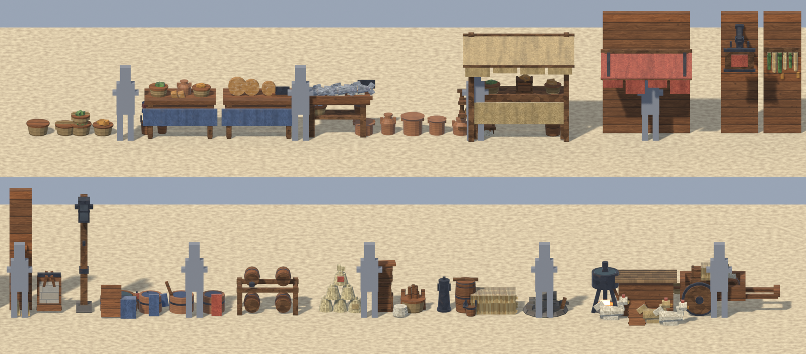
*道具层 94 件总览 —— `props.py` 建模 + 14 套 DRESS 配方，挂墙件贴真实前墙面（wall_y/wall_depth/reserved）；道具走 `dress()` 计入建筑立面而非建筑本体*

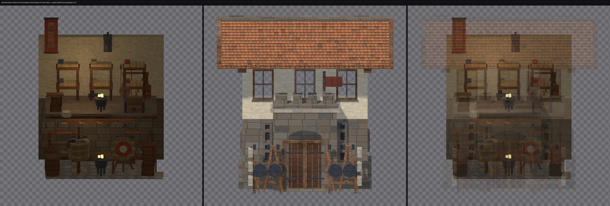
*内景分层 29 def —— `interiors.py` 每套含后墙+地板+楼板+功能家具+暖光，`_back/_front` 两层带 alpha 交付，像素对齐 29/29 ≤0.5px（复现游戏 WallFront 半透明机制）*

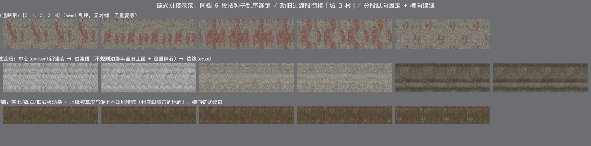
*地面分段链 —— `ground_tiles.py` 3 带（肩/缘/道）× 3 区带（center 石板大理石 / mid 旧砖碎石 / edge 夯土砾石）× 5 变体，可链式拼接；含规模包含映射（村=edge 子集、镇=mid+edge、城=全档）与位掩码过渡件*

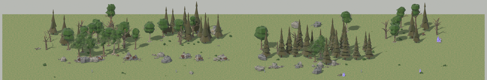
*自然物分布 —— `nature.py` + `field_dist.py` 16 类（阔叶/窄冠/针叶/枯树/树桩/灌木/芦苇/草丛/蘑菇群/水晶簇/金铜铁矿露头/矿脉带/碎石/巨岩等），已换 bark / alpha 叶卡 / rock / ore / crystal / grass_band 新材质；三级密度场（簇包络 × 子团 × 开天窗），实测离散指数 2.7（均匀分布≈0）*

**昼夜分层与 HD-2D 原型**

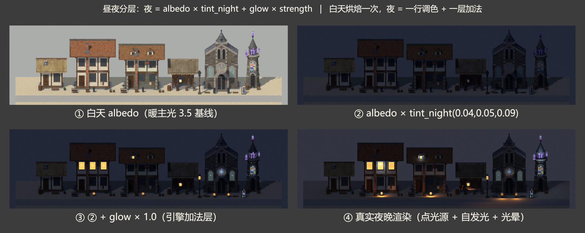
*昼夜分层四联 —— ① 白天 albedo（暖主光 3.5 基线）② albedo × tint_night ③ + glow×1.0（引擎加法层）④ 真实夜晚渲染；合成公式标定为 `夜 = albedo × tint(0.038,0.049,0.092) + glow × 1.0`，MAE 0.011*

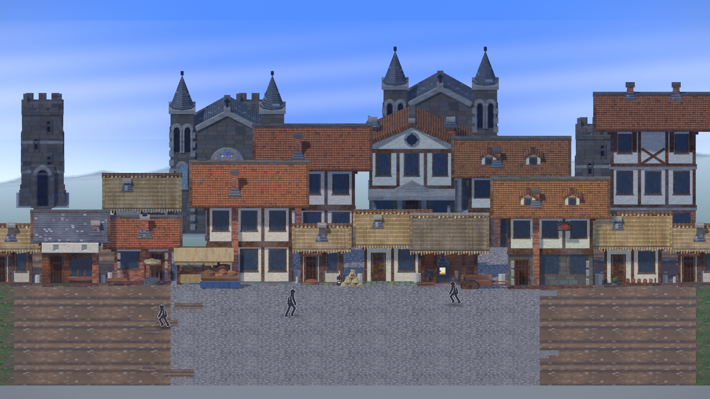
*HD-2D 原型（八方旅人式）—— 真 StickmanRig 经 SubViewport(2x + MSAA 4x) 贴相机对齐 billboard，建筑不透明通道写深度实现零成本遮挡；唯一性能成本为后处理 ≈3.3ms（分阶段方案见[2.5D 与 HD-2D 可行性](docs/技术/架构/2.5D与HD-2D可行性.md)）*

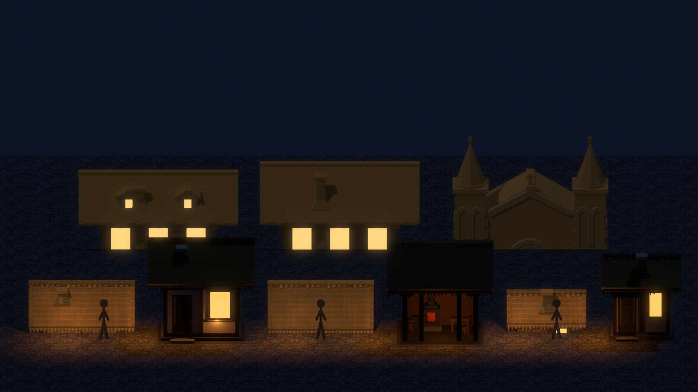
*2.5D 夜景原型 —— 同一批建筑与道具在夜晚光照下的合成效果，窗户由引擎侧抽 42% 随机点亮*

## 工程底座

- **模块化架构**：core（8 个全局服务）+ 14 个功能模块，每模块 `api.gd` 接口契约，模块间只走全局事件总线（32 信号）或 API——跨模块 `get_node` 与循环依赖有审计脚本把关
- **三层自动化测试**：60+ 脚本，单元层 2 秒跑完，集成层多进程并行，支持按 git 改动增量执行 + pre-commit 钩子强制
- **配套工具链**：Excel 导出器（校验+幂等）、程序化资产生成器（贴图/音效/天空）、GIF 录制脚本族
- **资产政策（Demo 阶段）**：机制可学、资产可搬——机制经反编译研读后自研落地；音效与音乐全量程序化合成（零提取件），来源与替换登记见[素材替换清单](docs/项目/素材替换清单.md)

## 仓库结构

```
├── stick-world/        # Godot 工程（res:// 根）
│   ├── core/           # 全局服务（EventBus/TimeManager/SaveManager…）
│   ├── modules/        # 14 个功能模块（world/combat/construction/ui_global…）
│   ├── assets/         # 程序化生成的贴图与音频
│   ├── tools/          # 编辑器工具与资产生成脚本（Python/GDScript）
│   └── tests/          # unit / integration / smoke / dev 四层测试
├── docs/               # 设计文档、技术架构、审计、演示物料
└── tools/              # 仓库级脚本
```

## 从源码运行

```bash
# Godot 4.7+ 打开 stick-world/ 项目（F5 运行），或：
godot --path stick-world
# 全量测试（unit / integration / smoke）
bash stick-world/tests/run_all.sh
```

## 开发状态与路线

**v0.4（当前）**：HD-2D 主街实机可玩——定居点建设、资源采集、编队战斗、组织指挥链一体；内置目标引导与胜利结算，通关后开放自由沙盒。
规划中：科技树/物流/扩张系统、战略图聚落下钻、Chunk 流式加载（见[待办事项](docs/项目/待办事项.md)）。

## 文档目录

**玩家与演示**

- [游戏演示说明](docs/演示/游戏演示说明.md) —— 怎么玩、Demo 阶段实现亮点、已知边界
- [游戏设计文档](docs/设计/游戏设计文档.md) —— 唯一设计真相源（愿景、玩法支柱、系统总览）

**系统设计**（docs/设计/系统/）

- [组织系统](docs/设计/系统/01-组织系统.md)（编队/兵种/命令）· [战斗系统](docs/设计/系统/02-战斗系统.md) · [定居点与建筑](docs/设计/系统/03-定居点与建筑.md) · [扩张系统](docs/设计/系统/03-扩张系统.md)
- [经济系统](docs/设计/系统/05-经济系统.md) · [科技系统](docs/设计/系统/04-科技系统.md) · [物流系统](docs/设计/系统/06-物流系统.md) · [成就系统](docs/设计/系统/07-成就系统.md)
- [程序化世界生成](docs/设计/系统/08-程序化世界生成.md)（分形大陆/Delaunay/河流）· [输入与操作](docs/设计/系统/09-输入与操作复刻.md) · [武器装备与个人库存](docs/设计/系统/10-武器装备与个人库存.md)

**技术架构**（docs/技术/架构/）

- 总览：[场景与战斗架构](docs/技术/架构/场景与战斗架构.md)（卷轴地图导读）· [战略图架构](docs/技术/架构/战略图架构.md)（多边形领土）· [世界地图数据流](docs/技术/架构/世界地图数据流.md)（生成端↔消费端契约）· [数据流全景](docs/技术/架构/数据流全景.md)
- 核心机制：[核心实体与状态机](docs/技术/架构/核心实体与状态机.md) · [系统交互与 EventBus](docs/技术/架构/系统交互与EventBus.md) · [模块 API 契约](docs/技术/架构/模块API契约.md) · [自动加载依赖](docs/技术/架构/自动加载依赖.md) · [模块依赖关系](docs/技术/架构/模块依赖关系.md)
- 专题：[火柴人战斗系统设计](docs/技术/架构/火柴人战斗系统设计.md) · [建筑模块化设计](docs/技术/架构/建筑模块化设计.md) · [存储架构设计](docs/技术/架构/存储架构设计.md)（SQLite）· [平衡框架](docs/技术/架构/平衡框架.md) · [寻路避障调研](docs/技术/架构/寻路避障调研.md)
- 场景与战斗子篇：[场景宿主](docs/技术/架构/场景与战斗/场景宿主架构.md) · [地图与场景图](docs/技术/架构/场景与战斗/地图与场景图.md) · [建筑与定居点](docs/技术/架构/场景与战斗/建筑与定居点.md) · [战斗与AI](docs/技术/架构/场景与战斗/战斗与AI.md) · [UI](docs/技术/架构/场景与战斗/UI.md) · [EventBus 信号契约](docs/技术/架构/场景与战斗/EventBus信号契约.md)

**参考逆向**（向经典游戏学习）

- [天空与水体逆向笔记](docs/技术/参考逆向/天空与水体逆向笔记.md) —— Terraria 云池/日月公式、Kingdom Two Crowns 边缘海的真源码研读记录

**开发教程**（docs/技术/教程/）

- [Excel 数据管线](docs/技术/教程/Excel数据管线.md)（12 张数值表怎么改怎么导）· [测试矩阵](docs/技术/教程/测试矩阵.md)（三层测试怎么跑）· [手绘贴图烘焙管线](docs/技术/教程/手绘贴图烘焙管线.md) · [建筑系统教程](docs/技术/教程/建筑系统教程.md) · [地图制作教程](docs/技术/教程/地图制作教程.md) · [程序化材质系统](docs/技术/教程/程序化材质系统.md) · [Godot 日志与报错检测](docs/技术/教程/Godot日志与报错检测.md) · [视频参考 K 帧工作流](docs/技术/教程/视频参考K帧工作流.md)

**流程与协作**

- [CONTRIBUTING](docs/CONTRIBUTING.md)（开发规范）· [AGENTS.md](AGENTS.md)（AI 辅助开发主规则：架构规范/文档导航/核心指令）· [CHANGELOG](docs/CHANGELOG.md) · [待办事项](docs/项目/待办事项.md) · [编辑器工具索引](docs/技术/编辑器工具索引.md)（addons/ + tools/ 全部脚本）
