# 火柴人大战略 Stick World

> **横版策略战争游戏** —— 定居点建设 · 小队编成 · 大规模实时战斗 · 单兵附身微操
> **引擎 Godot 4.x · 平台 Windows · 单人独立开发 3 个月、700+ 提交**

<!-- TODO: 录制 1-2 分钟实机视频传 B 站后，在此处补链接 -->

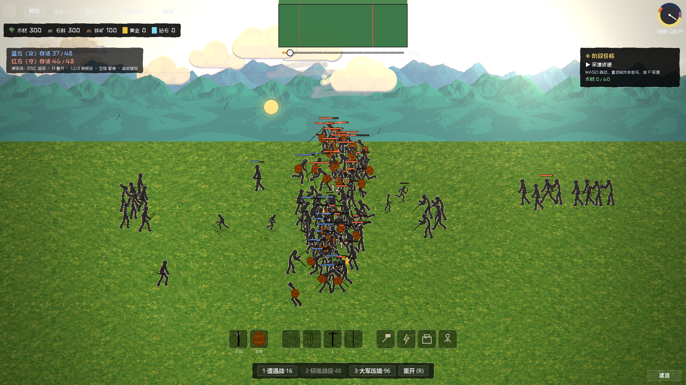

## 🎮 下载游玩

**[下载 Windows 版 v0.5.0（点击跳转 Release）](https://github.com/fanboran/stickworld/releases/latest)** —— 解压后双击 `stick-world.exe`，无需安装（Windows 10/11 64 位）。

## 游戏一览

| | |
|---|---|
| 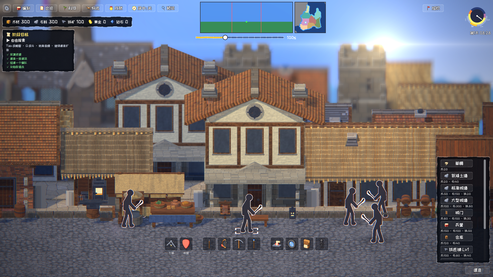 | 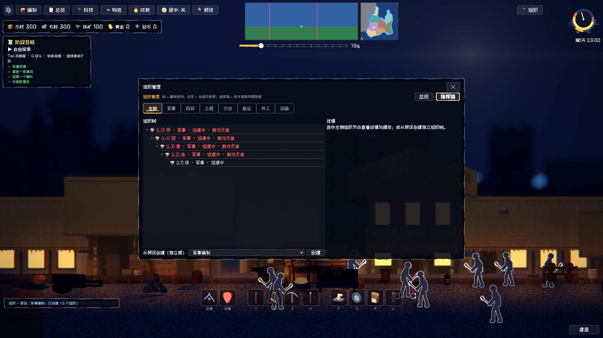 |
| 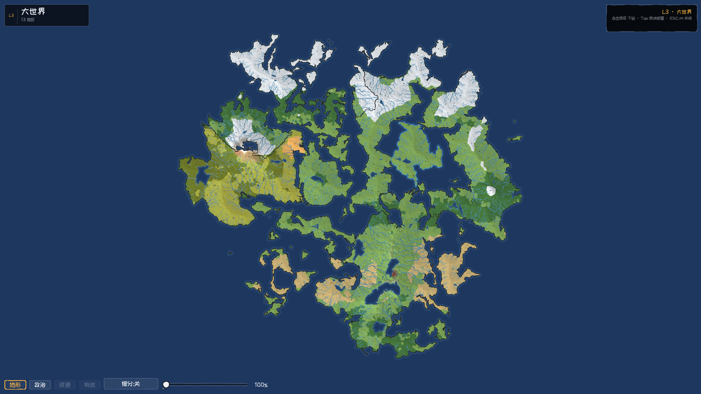 | 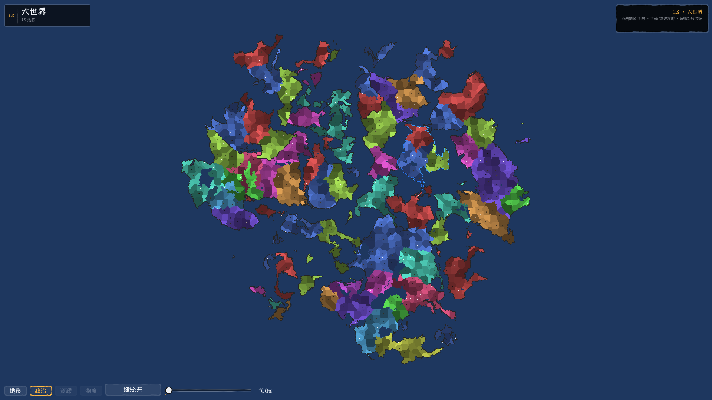 |
| 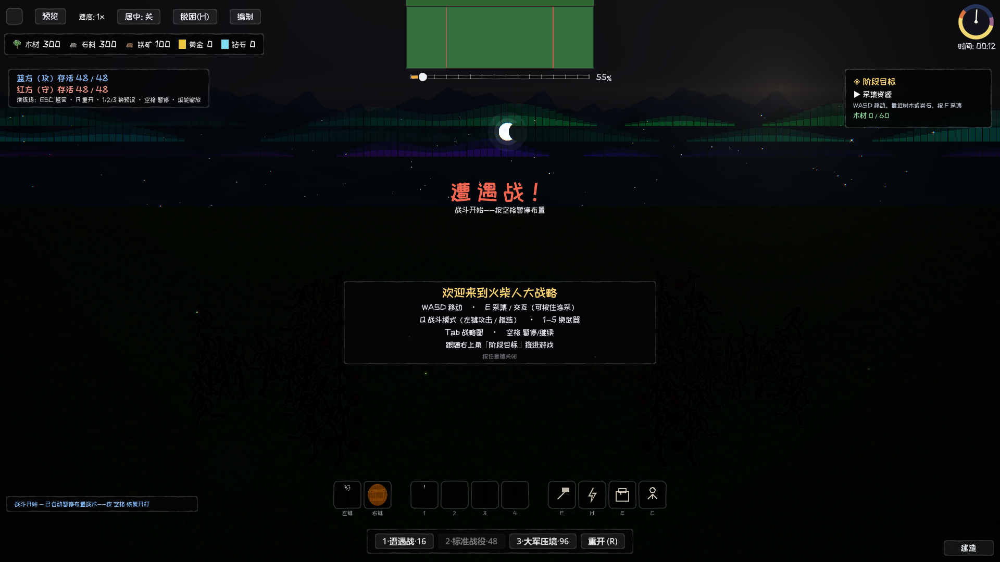 | |

### 更多实机画面

| | |
|---|---|
| 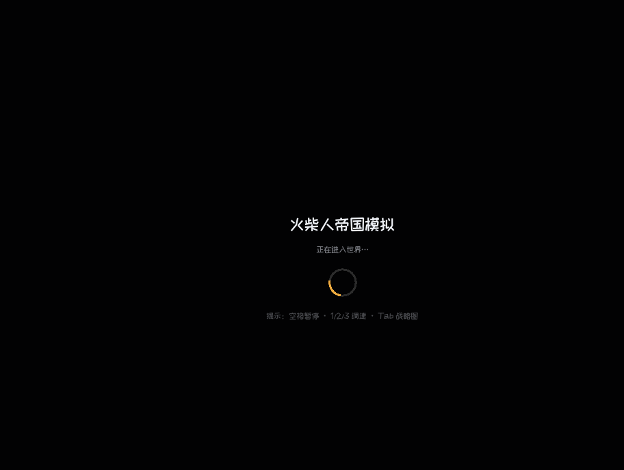 | 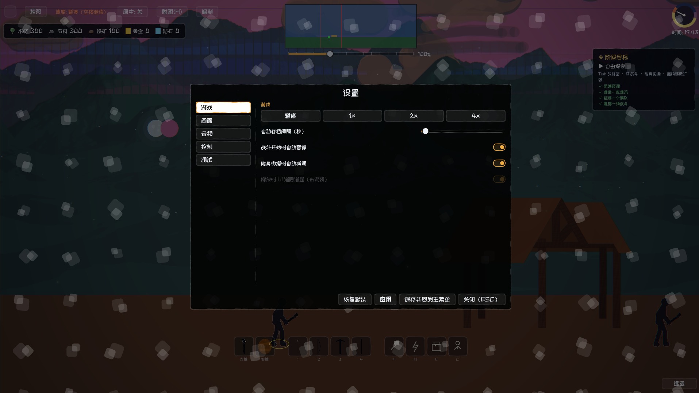 |
| 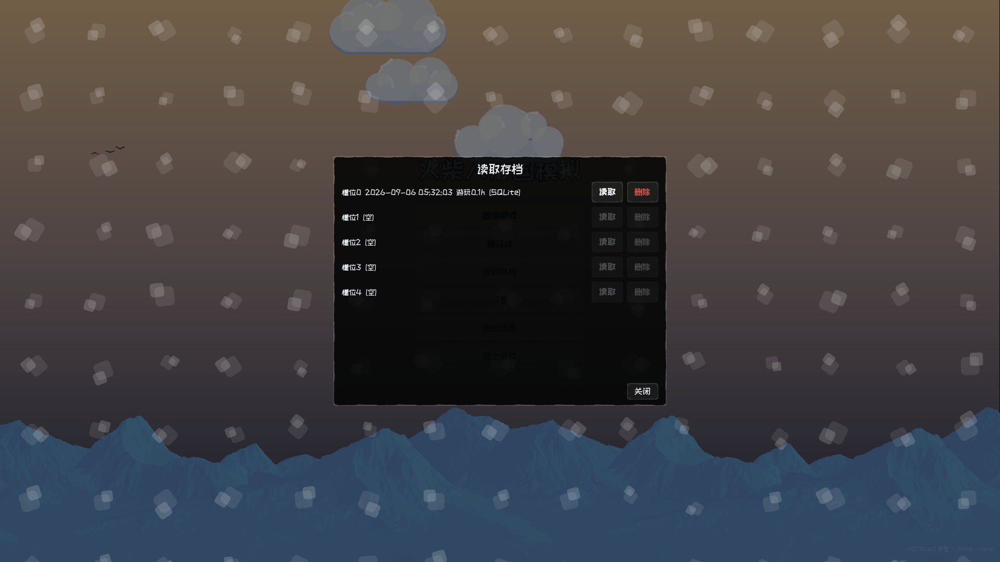 | 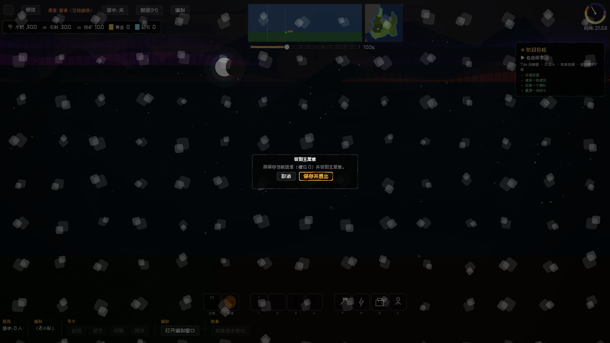 |
| 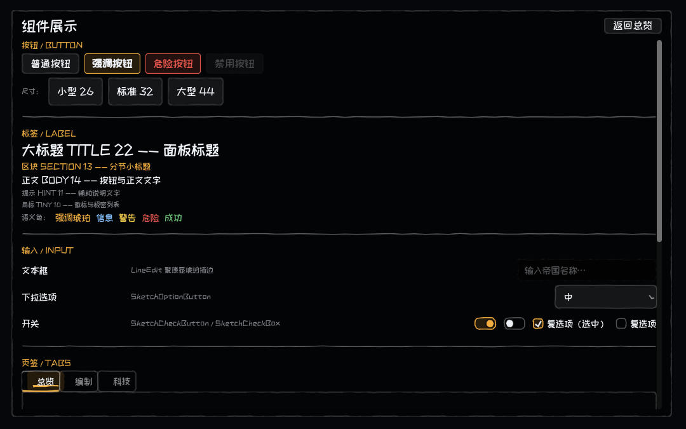 | 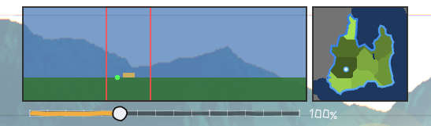 |

## 从新游戏到首胜（最快 10 分钟）

主菜单点「新游戏」，跟着右上角**阶段目标卡**走：**采集**（WASD 移动，靠近树木/岩石按 `E` 连采）→ **建造**（右下「建造」放建筑并施工）→ **编队**（顶栏「编制」创建编队，或 `Q` 框选士兵）→ **战斗**（带兵行军抵达战场，歼灭敌军）→ 胜利结算，开放自由沙盒（战略图 Tab/M、附身微操、跨图旅行、昼夜循环）。

完整说明与按键表见[游戏演示页](docs/演示/游戏演示说明.md)。

## 系统亮点

- **实时战斗**：兵种行为档案 AI——侧翼自动包抄、站桩微移、受击规避、风筝保距、攻击槽位排队；命令三级裁决（玩家 > 编队 > 单位本能）；近战在动画命中帧结算，箭矢带移动目标预判
- **大战略图**：程序化世界生成（分形大陆、Delaunay 高度场、河流追踪）产出"大陆—地区—地块"三级地图，地形/政治双模式渲染，21 万顶点预烘焙至 0.6 秒首开
- **经济与建造**：资源采集/建筑放置/施工/仓库区域账目，12 张 Excel 数值配置表为唯一数据源
- **附身微操**：附身任意单位亲自参战，配合走位与攻击节奏
- **昼夜与天空**：Terraria 式日月运行、380 颗程序星野、月相盈亏、逐顶点 HSL 极光、流星；六层单 pass 后处理（暖色分级/太阳炫光/色差/胶片颗粒）随昼夜联动

## 工程底座

- **模块化架构**：core（8 个全局服务）+ 14 个功能模块，模块间只走全局事件总线（32 信号）或 `api.gd` 契约，跨模块依赖有审计脚本把关
- **自动化测试**：60+ 脚本分单元/集成/冒烟三层，支持按 git 改动增量执行，pre-commit 钩子强制
- **程序化资产管线**：油画笔触贴图拟合（云/山/树/石）、numpy 合成音效与 BGM、贴图/天空生成器见 `tools/`
- **资产政策（Demo 阶段）**：机制可学、资产可搬——机制经反编译研读后自研落地；音效暂用参考游戏提取件占位，逐件登记于[素材替换清单](docs/项目/素材替换清单.md)，正式版前全量替换

## 从源码运行

```bash
# Godot 4.7+ 打开 stick-world/ 项目（F5 运行），或：
godot --path stick-world
# 全量测试（unit / integration / smoke）
bash stick-world/tests/run_all.sh
```

## 开发状态与路线

**v0.5.0（当前）**：首个公开可玩 Demo——内置目标引导与胜利结算，通关后开放自由沙盒。
规划中：科技树/物流/扩张系统、战略图聚落下钻、Chunk 流式加载（见[待办事项](docs/项目/待办事项.md)）。

## 文档

- [游戏演示页](docs/演示/游戏演示说明.md) —— 怎么玩、亮点、已知边界
- [游戏设计文档](docs/设计/游戏设计文档.md) —— 唯一设计真相源
- [技术架构索引](docs/技术/架构/场景与战斗架构.md) —— 模块/API/数据流全景
- [CHANGELOG](docs/CHANGELOG.md)
