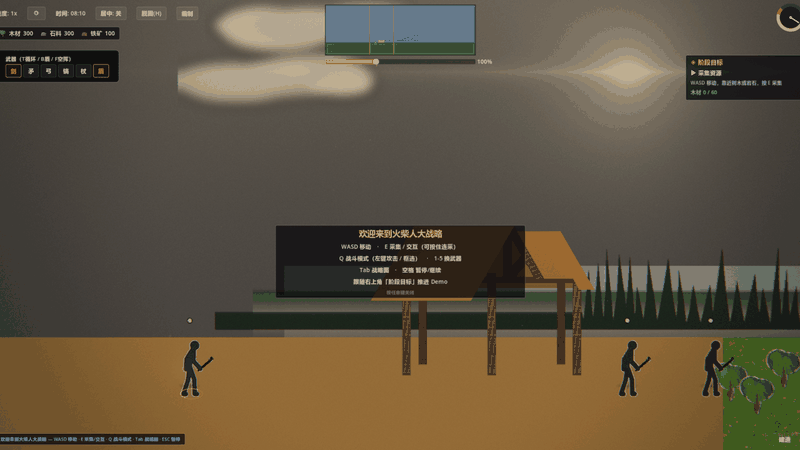
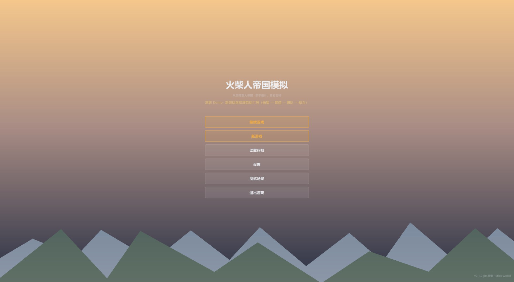
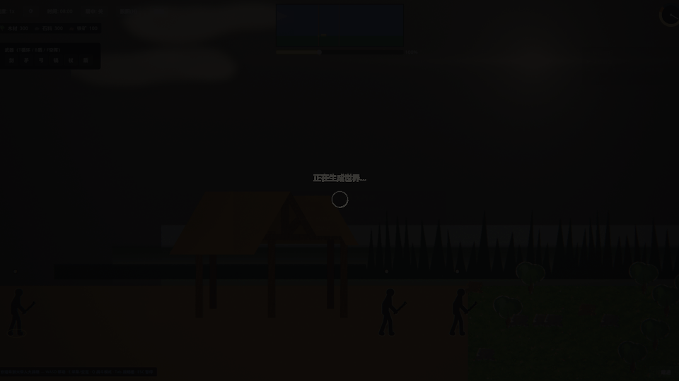

# 火柴人大战略 Stick World

> 大战略 × 横版实时战斗 × 工厂自动化 —— 单机缝合怪，按商业化标准开发的独立项目。
> **引擎 Godot 4.x / GDScript · 平台 Steam PC · 画风 平面 2D 火柴人 + 手绘感笔触**

一个火柴人世界的"帝国模拟器"：从部落时代的采集建造，到编队出征的横版实时战斗，再到战略图上的大陆征服与工厂自动化。单人开发，核心玩法循环已可玩。







## 快速开始

```bash
# Godot 4.x 编辑器打开 stick-world/ 项目（F5 运行）
# 或命令行直接跑：
godot --path stick-world

# 全量测试（unit / integration / smoke 三层，约 3 分钟）
bash stick-world/tests/run_all.sh
```

**十分钟体验路线**：主菜单「新游戏」→ WASD 移动，靠近树木/岩石按住 `E` 连采 → 右下「建造」放一栋建筑并施工 → 顶栏「编制」创建编队 → 带兵向右行军抵达战场歼灭敌人 → 胜利结算后自由沙盒（战略图 Tab/M、附身微操、跨图旅行、昼夜循环）。完整说明见[求职 Demo 展示页](docs/演示/求职Demo说明.md)。

## 玩法与系统

| 域 | 内容 |
|---|---|
| **引导与胜负** | 四阶段目标链（采集→建造→编队→战斗）全事件驱动，世界内引导（NPC 气泡/方向箭头/按钮呼吸），胜利结算 |
| **实时战斗** | 兵种行为档案 AI（参考 Running with Rifles 参数化）：侧翼包抄、站桩微移、受击规避、风筝保距、攻击槽位排队；命令三级裁决（玩家 > 编队 > 单位本能） |
| **大战略图** | 程序化世界生成（分形大陆、Delaunay 高度场、河流追踪、流域切分）产出"大陆—地区—地块"三级战略图 |
| **经济与建造** | Excel 数值配置管线（12 张表为唯一数据源），资源采集/建造/仓库区域账目 |
| **昼夜与天空** | Terraria 式日月运行（线性横穿+抛物线高度，逆向真源码）、星野/流星/极光、Kingdom 式边缘海倒影 |

## 渲染与美术管线（零外部资产）

- **六层单 pass 全屏后处理**：暖色分级、太阳炫光（核心+光芒+ghost+呼吸）、渐晕、边缘色差、胶片颗粒，昼夜联动参数驱动
- **多层视差天空**：星野(0.08)→飞鸟(0.35)→远山(0.55)→树线/雾带(0.7-0.88)，Terraria 云池逆向（尺度=深度视差、风驱动、天空色继承）
- **程序化笔触管线**：程序合成参考图 → 油画笔触算法拟合（StrokeGenerator：分层笔触+画布叠压）→ 形状 mask 抠图 → 游戏贴图
- **程序化音频**：numpy 合成 14 个 WAV 音效 + Am-F-C-G 氛围 BGM 无缝循环
- 参考游戏逆向笔记：[docs/技术/参考逆向/天空与水体逆向笔记.md](docs/技术/参考逆向/天空与水体逆向笔记.md)

## 工程底座

- **模块化架构**：core（8 个全局服务）+ 14 个功能模块，每模块 `api.gd` 接口契约，模块间只走全局事件总线（32 信号）或 API——跨模块 `get_node` 与循环依赖有审计脚本把关
- **三层自动化测试**：60+ 脚本，单元层 2 秒跑完，集成层多进程并行，支持按 git 改动增量执行 + pre-commit 钩子强制
- **性能工程**：战略图 21 万顶点运行时剖分 11.6s → headless 烘焙二进制，首屏 10.6s → 0.6s
- **配套工具链**：Excel 导出器（校验+幂等）、程序化资产生成器（贴图/音效/天空）、GIF 录制脚本族
- **96 篇架构文档**：设计/技术/审计分层，见 [docs/](docs/) 与 [AGENTS.md](AGENTS.md)

## 仓库结构

```
├── stick-world/        # Godot 工程（res:// 根）
│   ├── core/           # 全局服务（EventBus/TimeManager/SaveManager…）
│   ├── modules/        # 14 个功能模块（world/combat/construction/ui_global…）
│   ├── assets/         # 程序化生成的贴图与音频
│   ├── tools/          # 编辑器工具与资产生成脚本（Python/GDScript）
│   └── tests/          # unit / integration / smoke / dev 四层测试
├── docs/               # 设计文档、技术架构、审计、演示物料
└── tools/              # 仓库级脚本
```

## 相关文档

- [求职 Demo 展示页](docs/演示/求职Demo说明.md) —— 怎么玩、亮点、已知边界
- [游戏设计文档](docs/设计/游戏设计文档.md) —— 唯一设计真相源
- [技术架构索引](docs/技术/架构/场景与战斗架构.md) —— 模块/API/数据流全景
- [CHANGELOG](docs/CHANGELOG.md) / [待办事项](docs/项目/待办事项.md)
