# V2 世界重生成·验收图解

> **是什么**：世界重生成 V2 全链的 17 张验收图讲解——每张图嵌图 + 说明"看什么、怎么生成的"。
> **用途**：创始人过图验收的入口文档；图本体在本目录（仓库内，随分支分发）。
> **数据口径**：176 政权 / 1036 城 + 6 原址复种点 = 1042 城块，纯「最近聚落抗衡」无缝铺满陆地（灰 0.168% = 无聚落小离岛）；每张图的生成脚本与上游输入见 [tools/worldgen/README.md](../../../tools/worldgen/README.md) §世界重生成 V2 链与验收图管线。
> **分组**：A 世界底层场 → B 聚落与城块（本轮修复主战场）→ C 政权 → D 线网 → E 视觉表现。

---

## A · 世界底层场（聚落与政权的"地理气候"）

四张场图决定"哪里富、哪里穷、哪里好打"——聚落密度、文化分界、政权扩张难度都从它们推导。本轮未改动，列出供对照上游。

### A1 宜居度场

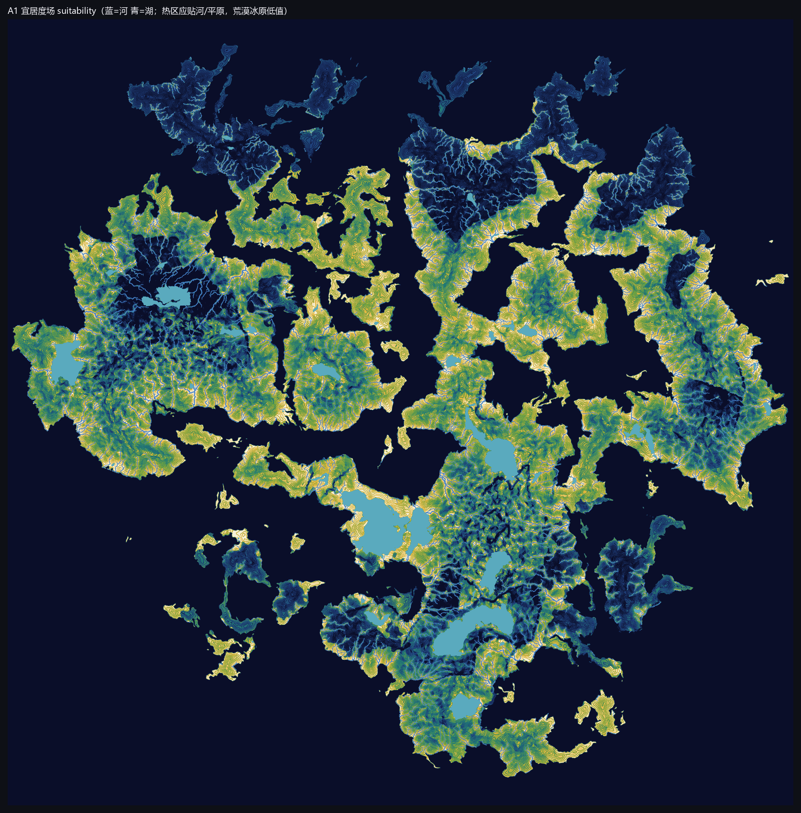

- **看什么**：绿黄白=宜居（沿海/平原/河谷成片），深蓝=不宜居（高山/荒漠/冰原）。宜居度直接决定聚落撒点密度与城块主张半径——富庶带城块小而密、贫瘠带大而稀。
- **生成**：`l3/fields_build.py`（FBM 值噪声 + 群系基底 + 高程/河流修正）。

### A2 资源丰度场

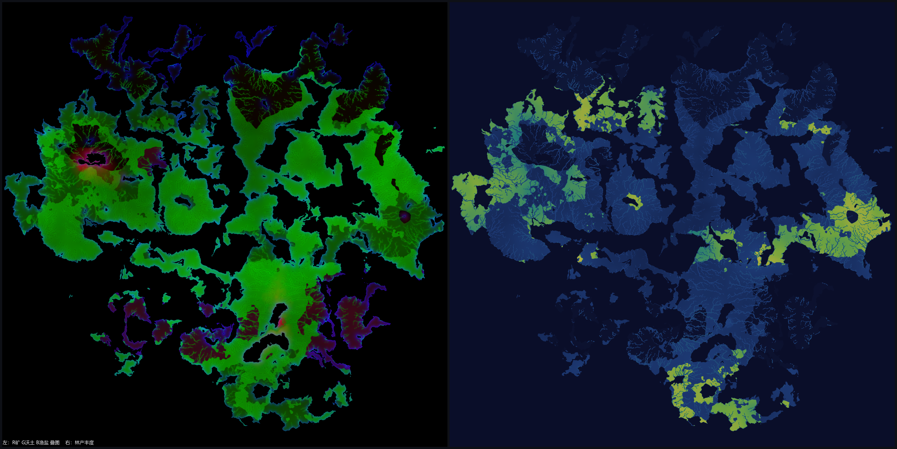

- **看什么**：矿脉/渔盐/沃土四通道叠加成带成片（FBM 空间自相关，无椒盐噪点）。资源分进聚落规模谱，也在游戏内做资源点分布。
- **生成**：`l3/fields_build.py`（多倍频 FBM，ridged 变换造矿脉带）。

### A3 进攻成本场

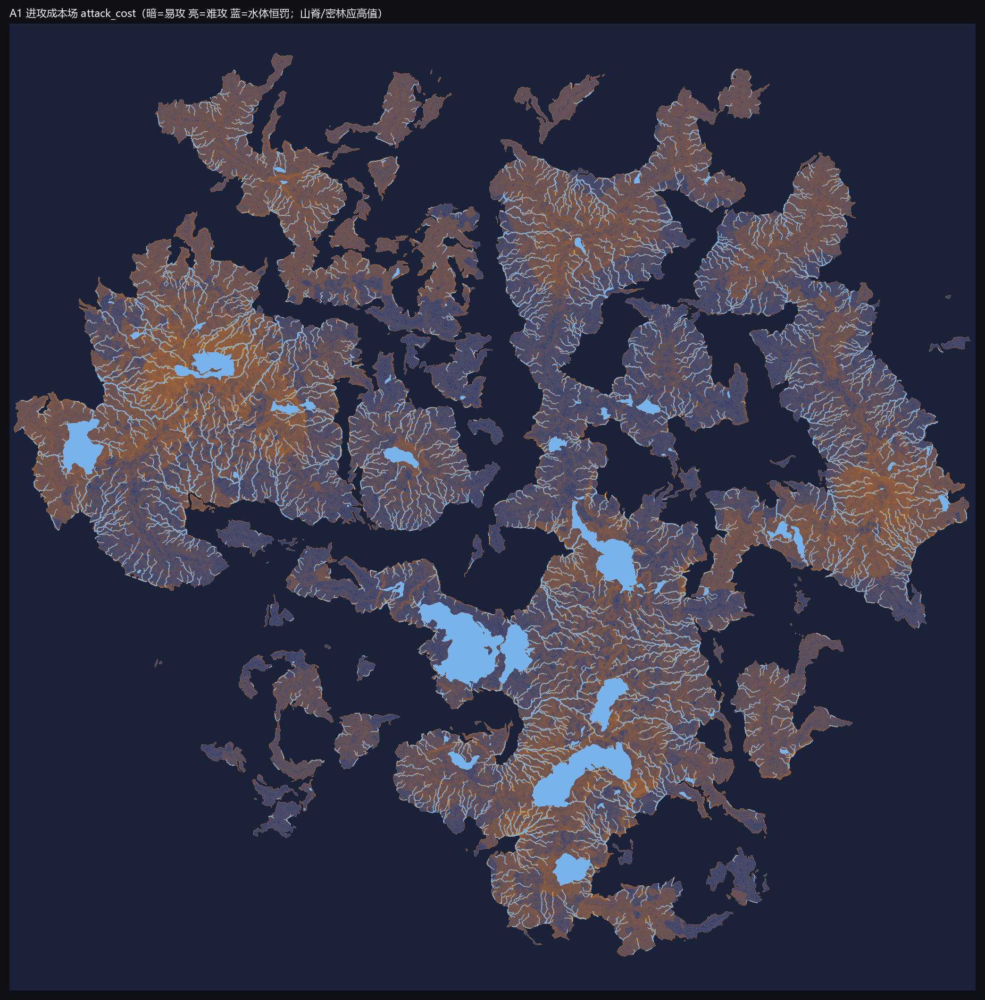

- **看什么**：亮=难攻（山地/荒漠/冰原），暗=易攻（平原走廊）。政权合并的边权用它——山国天然难统一、平原国天然易扩张，是"地区天生碎/不碎"的来源之一。
- **生成**：`l3/fields_build.py`（flood-fill 成本场）。

### A4 文化场

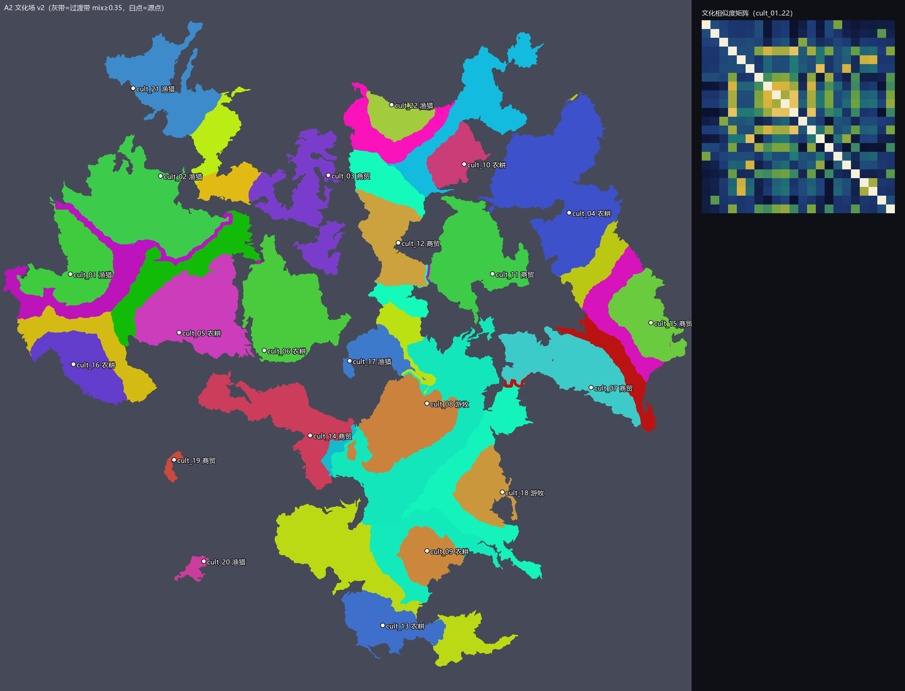

- **看什么**：22 个文化域的界线与过渡带。文化决定政权配色（同文化同色系深浅）与合并倾向（同文化边权低）。
- **生成**：`l3/culture_build.py`（源点 flood + 种族映射：八种族按群系席位落位）。

---

## B · 聚落与城块（本轮修复主战场）

### B1 聚落分布撒点图

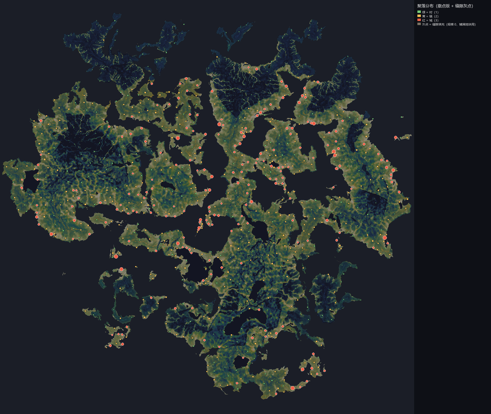

- **看什么**：每个点=一个聚落，**点越大规模越大**；绿=村 / 黄=镇 / 红=城（城带白描边）；灰点=规模 0 的原址复种点（只占地块、不参与政权）。共 1042 点：1036 正常 + 6 原址点。贫瘠带整片无点（真实的无人区），富庶带点密成簇。
- **生成**：A3 变半径泊松盘撒点（`l3/settlement_build.py`，原址点见 `l3/origin_seed_recover.py`），终图 `l3/settle_preview_v2.py`。
- **验收看点**：撒点疏密是否符合"富庶密/贫瘠稀"。

### B2 聚落密度核密度图

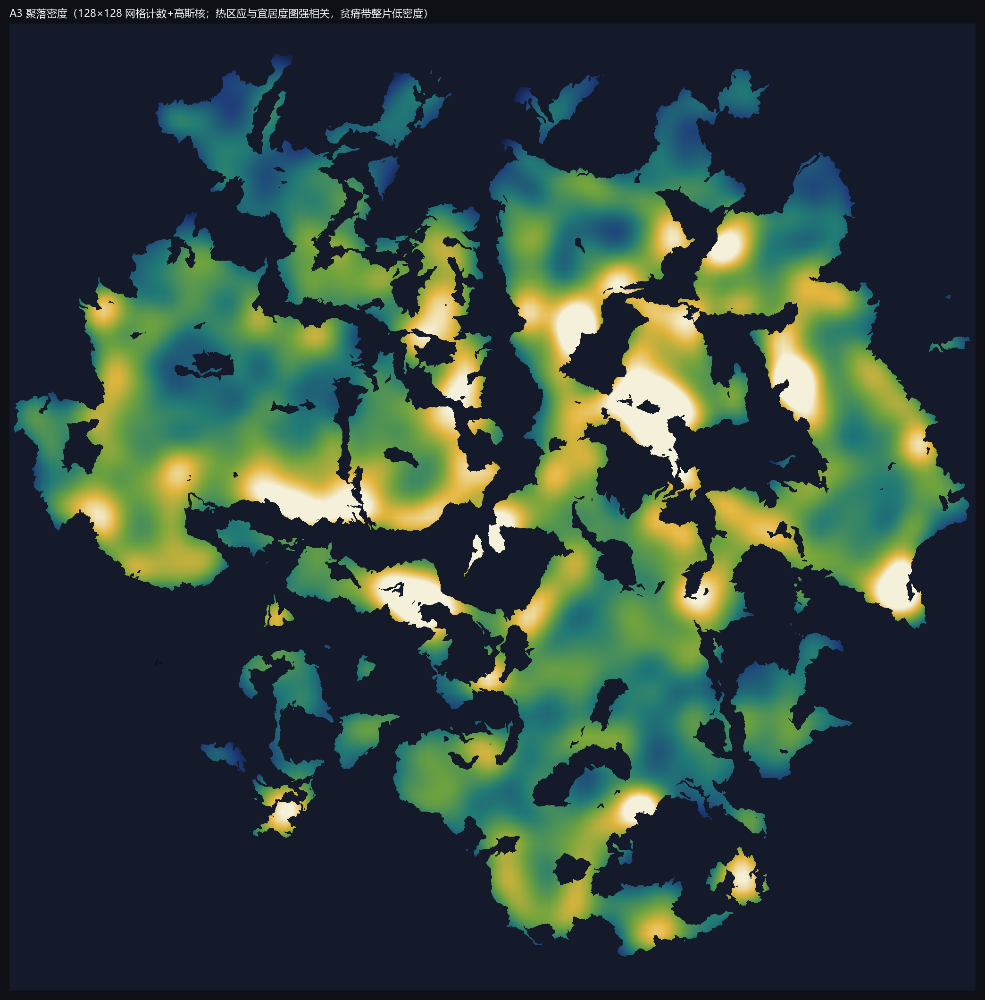

- **看什么**：撒点密度的平滑热度图，一眼看出"文明带"的走向（沿海/沿河亮带）。
- **生成**：`l3/settlement_build.py`（网格计数核密度）。

### B3 城块划分终图（核心验收图）

- **看什么**：**一地块一色、一地块一聚落**（1042 块与 B1 的点一一对应）。每块形状=纯「最近聚落抗衡」的等分线——无缝多边形拼满陆地（灰 0.168% = 无聚落小离岛）；富庶带块小而密、贫瘠带块大而疏；**隔水相望的岛不被对岸染色**（跨陆块城块=0）。
- **生成**：`l1/city_split_v3.py`（EDT 最近聚落抗衡 + 主张盘封顶 ×1.3 + 同陆块并缝）→ `l3/refine_city_labels.py`（fBm 域扭曲边界自然化 + 同陆块回填）→ `l3/city_preview_from_refined.py` 终图。
- **验收看点**：①圆块拼合是否自然；②海岸线是否贴合；③群岛每个有人岛是否都有自己的色块。

### B4 城块分区索引图

- **看什么**：城块的 label 编码视图（按包窗口着色），供程序检查用，观感验收可略过。
- **生成**：`l1/city_split_v3.py` 内建。

### B5 城块聚落标记图

- **看什么**：灰底上红点标出全部聚落位置，核对点位与城块的 1:1 对应。
- **生成**：`l1/city_split_v3.py` 内建。

### B6/B7 边界细化前后对比

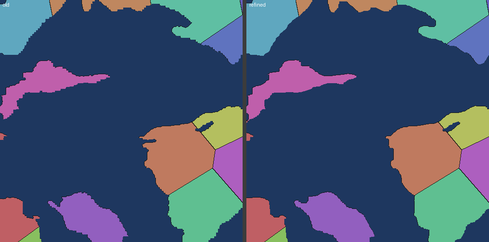

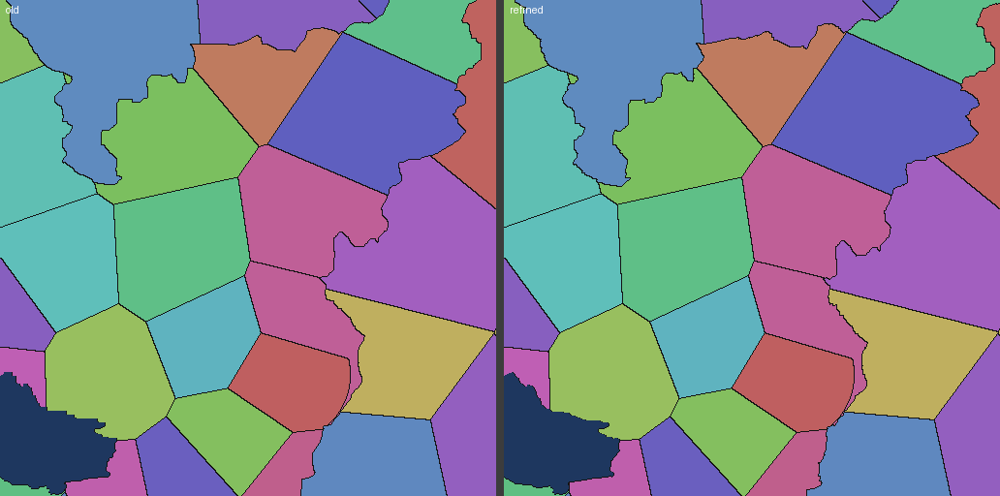

- **看什么**：左旧右新。海岸/湖岸/L1 地块间边界经 fBm 域扭曲自然化（分形曲折），同老 L1 内的城-城边界保持人工直线分割的设计感。
- **生成**：`l3/refine_city_labels.py` 自带对比预览。

---

## C · 政权

### C1 政治图（176 政权）

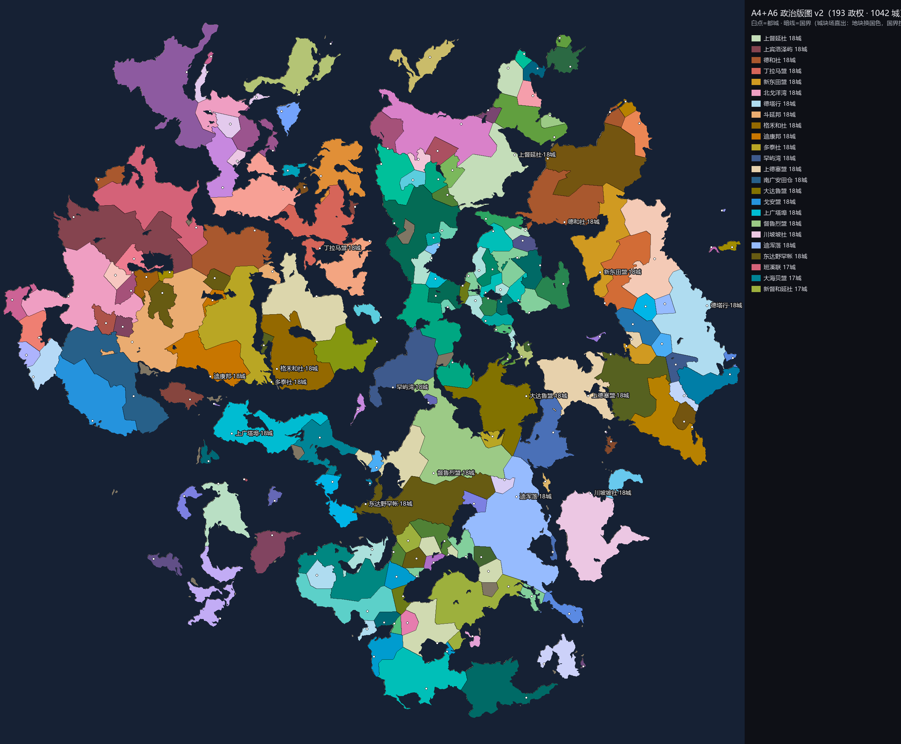

- **看什么**：176 个政权的疆域。**配色=文化色带**——同文化/同种族的国家用同一色系的不同深浅（呼应 A4 文化场）；灰=无主荒地（未入任何政权的城块，合法存在）；白点=都城。政权规模谱：1 城邦与 12+ 城大国并存、最大 18 城；八种族七种有国。
- **生成**：`l3/state_build_v2.py`（随机规模谱 + 岛屿统一因子 + A6 加速历史 + 构型命名；预览读 refined 场渲染）。
- **验收看点**：①同文化色带是否可辨识；②出生区附近是否一堆 1-3 城小国；③群岛小国是否完整（不再跨海飞地）。

### C2 政权规模谱直方图

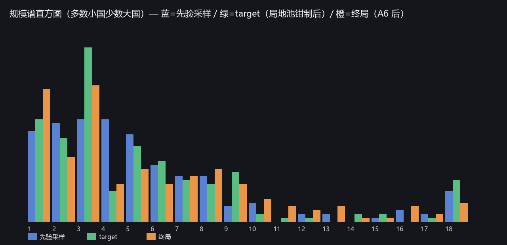

- **看什么**：政权规模的分布（先验/target/终局三系列）——"上百小政权"起点的形态学：大量 1-3 城小国 + 少量区域大国。
- **生成**：`l3/state_build_v2.py` 内建。

---

## D · 线网

### D1 河流矢量

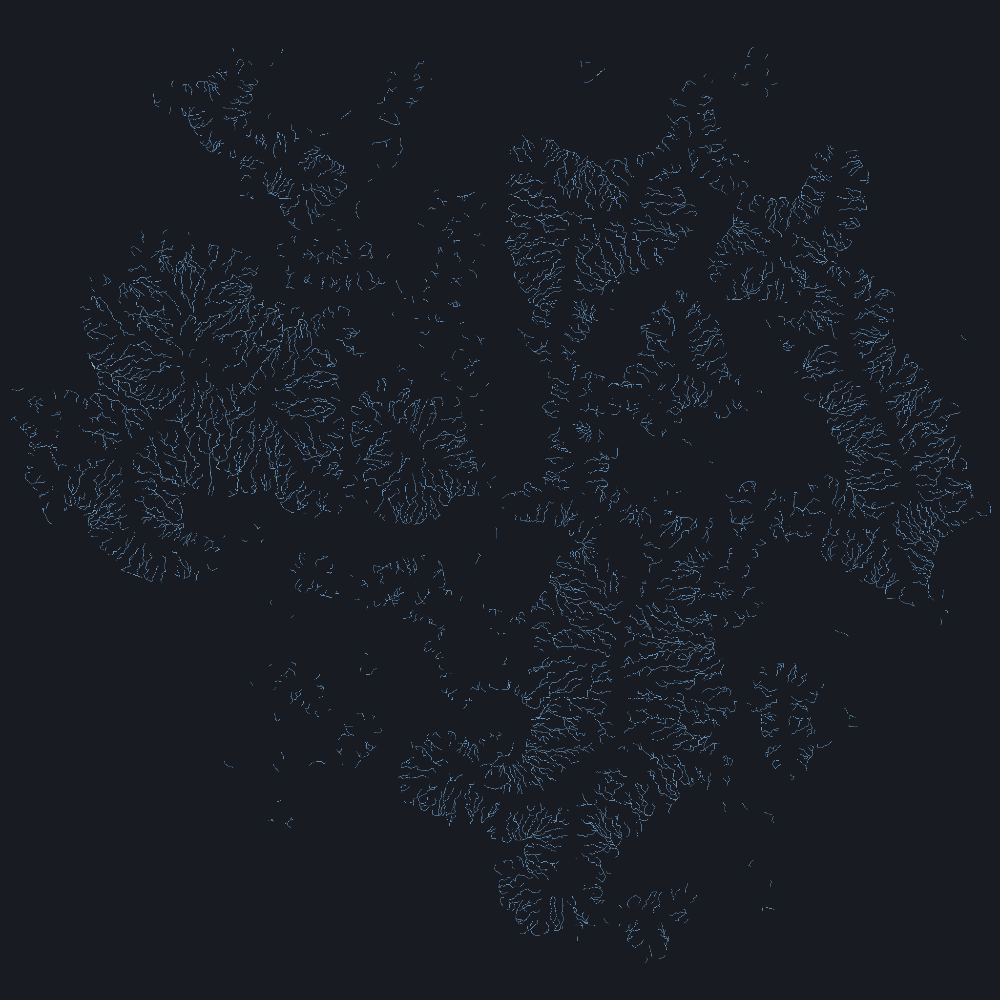

- **看什么**：注入 70 包的河流折线（贴地形、顺流向）。
- **生成**：`l2_export/river_export.py`。

### D2 道路网络

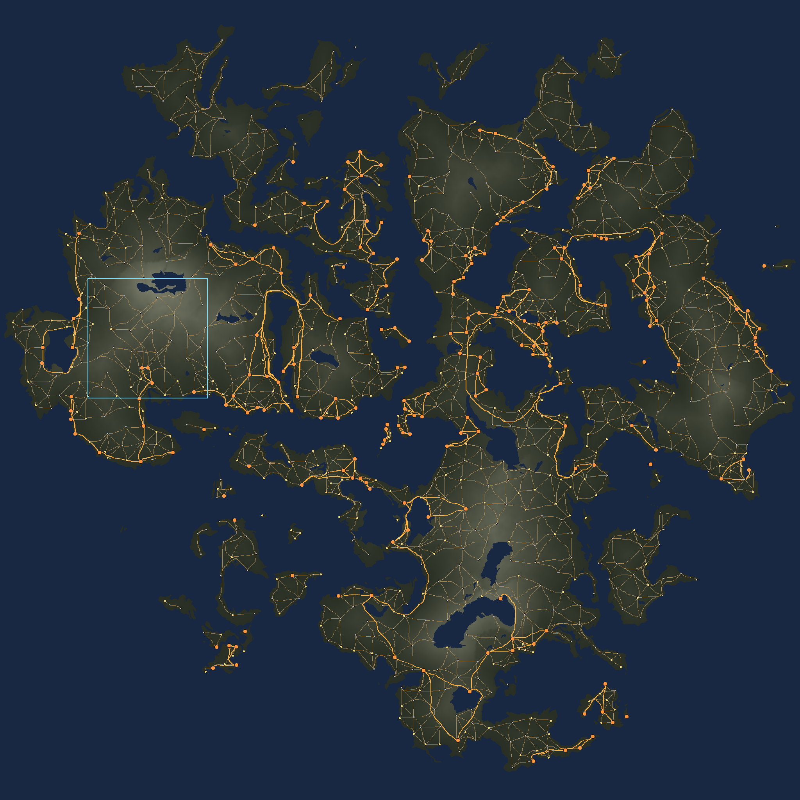

- **看什么**：2185 条城间道路，贴地形折线（绕山不走崖），跨包接缝连续。连接的是正常聚落（原址复种点不修路）。
- **生成**：`l1/road_generate.py`。

> 原 D3/D4（弧拓扑预览）已退出验收清单：渲染出来与 C1/B3 同源同观感，其真正产出是矢量数据与内部指标（共享弧配对率、面积守恒）——降为管线自检（`l3/arc_topology.py`，收线时 `--write` 落地），观感以实机描边为准。

---

## E · 视觉表现

### E1/E2 blob 城市轮廓

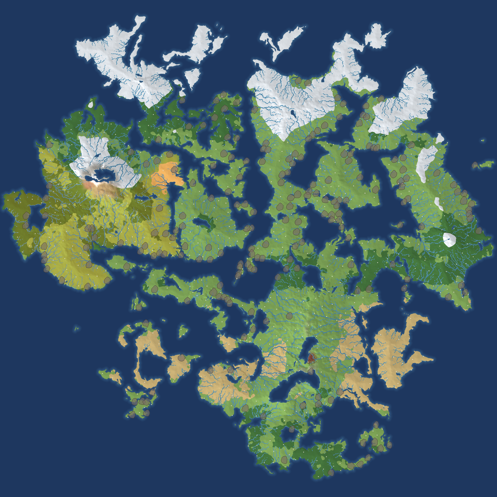

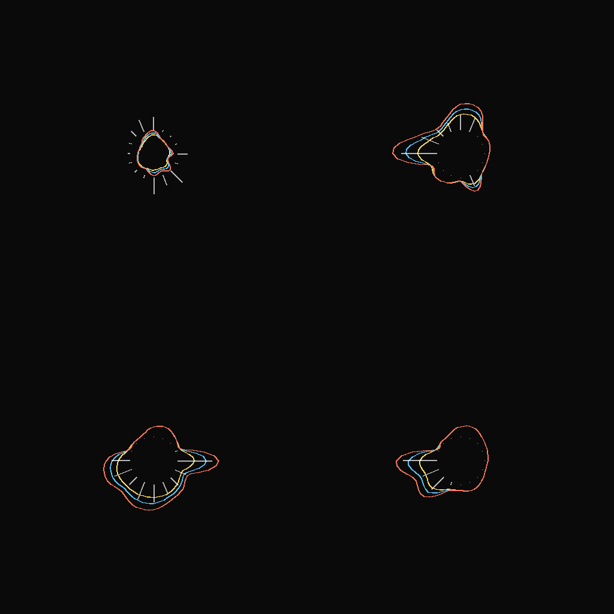

- **看什么**：城市在战略图上的有机形状轮廓（**现行径向容量管线**：16 方向各测地形容量，被山卡、被水卡 → 不规则有机形）。E2 特写 = 出生城 + 容量跨度最大 3 城，各画三档嵌套轮廓（黄 s=0.2 / 青 s=0.5 / 红 s=0.9，白色辐射条 = 该方向生长容量）；三档差异由 submodule `blob_params.json` levels/gamma 段控制。
- **生成**：`l1/blob_preview_v2world.py`（旧管线形状公式接 V2 聚落表，不写游戏包）；游戏包烘焙走 `l1/blob_bake.py`（随 §五属性回写后执行）。

---

## 验收清单速查

| 组 | 状态 | 请重点看 |
|---|---|---|
| A 场预览 ×4 | 定稿 | 对照理解 B/C 的密度与色带来源 |
| B 聚落城块 ×7 | **纯抗衡重出** | B1 撒点疏密、B3 无缝多边形拼合（无圆块无灰缝）、B6/B7 边界自然化 |
| C 政权 ×2 | **纯抗衡重渲** | C1 文化色带 + 出生区小国群 + 无跨海飞地 |
| D 线网 ×2 | 定稿 | D2 道路走向合理性 |
| E blob ×2 | **旧管线重出** | 有机形状是否回归、三档规模差异是否拉开 |

> 出生点确认：关洋湾（`settlement_city_427`，2 城小国都城）——在 C1 政治图出生区查看。
