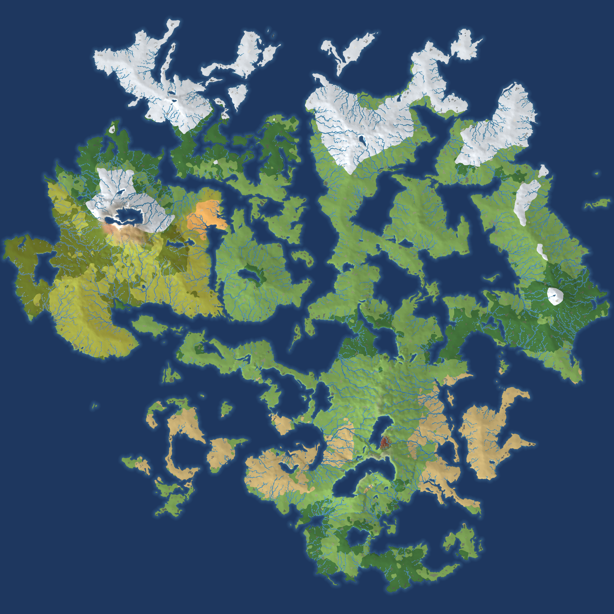
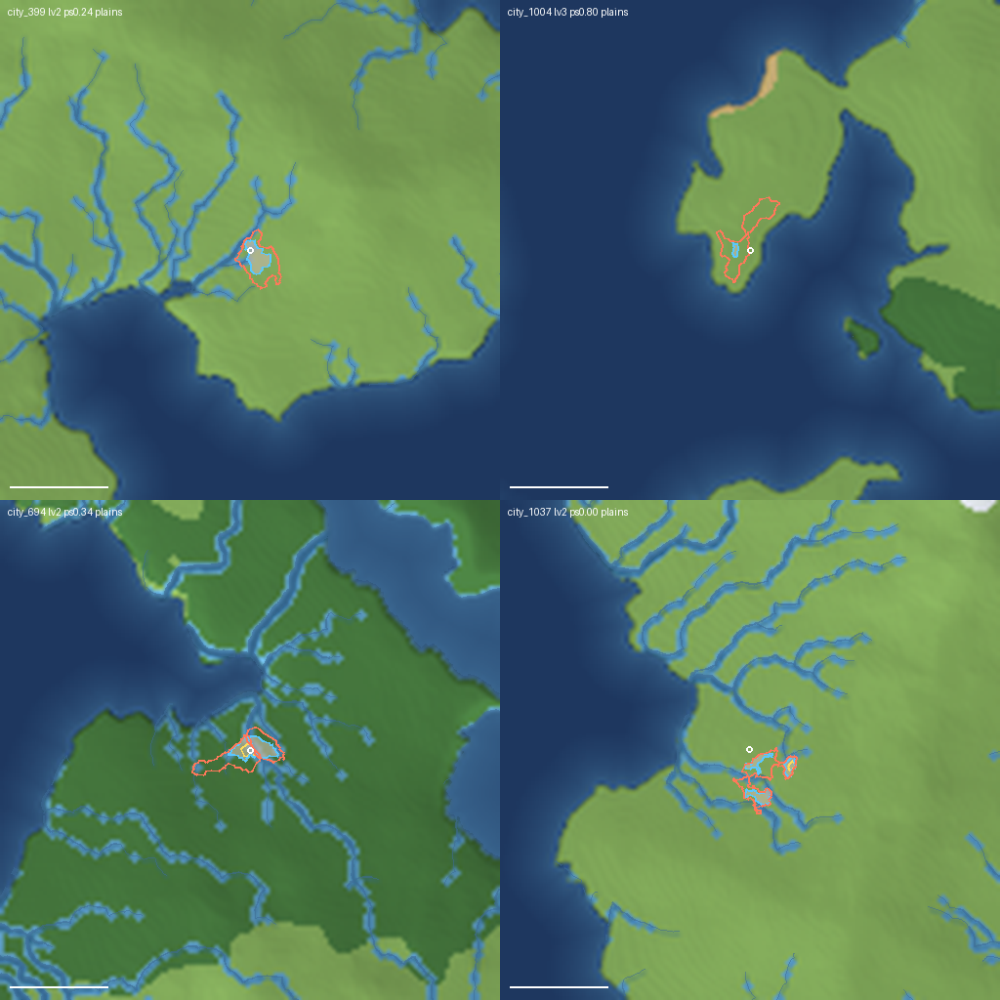

# V2 世界重生成·验收图解

> **是什么**：世界重生成 V2 全链的 17 张验收图——先按组看图，逐图说明在底部统一表格。
> **用途**：创始人过图验收的入口文档；图本体在本目录（仓库内，随分支分发）。
> **数据口径**：193 政权 / 1036 城 + 6 原址复种点 = 1042 城块，纯「最近聚落抗衡」无缝铺满陆地（灰 0.168% = 无聚落小离岛）；生成脚本与上游输入见 [tools/worldgen/README.md](../../../tools/worldgen/README.md) §世界重生成 V2 链与验收图管线。

---

## A · 世界底层场

## B · 聚落与城块

## C · 政权

## D · 线网

## E · 视觉表现

---

## 逐图说明

| 图 | 看什么（含验收看点） | 生成 |
|---|---|---|
| A1 宜居度场 | 绿黄白=宜居（沿海/平原/河谷成片），深蓝=不宜居（高山/荒漠/冰原）；直接决定聚落密度——富庶带块小而密、贫瘠带大而稀 | `l3/fields_build.py` |
| A2 资源丰度场 | 矿/渔盐/沃土成带成片（FBM 空间自相关，无椒盐噪点）；分进聚落规模谱，也做游戏内资源点分布 | `l3/fields_build.py` |
| A3 进攻成本场 | 亮=难攻（山地/荒漠/冰原），暗=易攻（平原走廊）；政权合并边权用它——山国难统一、平原国易扩张 | `l3/fields_build.py` |
| A4 文化场 | 22 个文化域的界线与过渡带；决定政权配色（同文化同色系深浅）与合并倾向 | `l3/culture_build.py` |
| B1 聚落分布撒点 | 点大小=规模：绿=村/黄=镇/红=城（白描边），灰点=6 原址复种点（只占地块不参政权）；共 1042 点；验收=疏密符合"富庶密/贫瘠稀"，贫瘠带整片无人、富庶带密簇 | `l3/settlement_build.py` + `l3/settle_preview_v2.py` |
| B2 聚落密度 | 撒点密度的平滑热度图，看"文明带"走向（沿海/沿河亮带） | `l3/settlement_build.py` |
| **B3 城块划分终图（核心）** | 一地块一色一聚落（1042 块与 B1 点一一对应）；块形=纯「最近聚落抗衡」等分线，无缝多边形拼满陆地（灰 0.168%=无聚落离岛）；富庶小密/贫瘠大疏；岛不被对岸染色（跨陆块=0）；验收=拼合自然、海岸贴合、群岛有人岛各有色块 | `l1/city_split_v3.py` → `l3/refine_city_labels.py` → `l3/city_preview_from_refined.py` |
| B4 城块分区索引 | label 编码视图（按包窗口着色），程序检查用，观感验收可略过 | `l1/city_split_v3.py` 内建 |
| B5 城块聚落标记 | 灰底红点标全部聚落，核对点位与城块 1:1 对应 | `l1/city_split_v3.py` 内建 |
| B6 细化对比·海岸段 | 左旧右新：海岸/湖岸/L1 地块间边界 fBm 域扭曲自然化（分形曲折） | `l3/refine_city_labels.py` 自带 |
| B7 细化对比·内陆界 | 同 B6，内陆段；同老 L1 内的城-城边界保持直线分割的设计感 | `l3/refine_city_labels.py` 自带 |
| C1 政治图 | 涌现制 193 国疆域（城块场渲染严丝合缝）；灰=无主；白点=都城（涌现：国内人口最高城）；验收=色带可辨、出生区小国群、无跨海飞地 | `l3/state_build_v2.py` |
| C2 规模谱直方图 | 先验/target/终局三系列——"上百小政权"起点形态：大量 1-3 城小国 + 少量区域大国 | `l3/state_build_v2.py` 内建 |
| D1 河流矢量 | 注入 70 包的河流折线（贴地形、顺流向） | `l2_export/river_export.py` |
| D2 道路网络 | 2185 条城间道路贴地形折线（绕山不走崖），跨包接缝连续；连接正常聚落（原址点不修路） | `l1/road_generate.py` |
| E1 blob 城市剪影全图 | 城市剪影（**现行 R5 场叠加管线**——与游戏内 Tab 城区图同源；场场叠加→阈值→marching squares，建成区限自身城块内，地块不规则→形状有机多样）；**无描边，填充色取城周地形环带**（脱饱和暖灰化，与底图同源不悬浮——创始人 2026-09-28） | `l1/blob_v2_generate.py` |
| E2 blob 代表城特写 | 出生城 + 代表城三档嵌套（low/mid/high 随人口切档）；档差由 submodule `blob_params.json` levels 段 + `blob_v2_params.json` 控制 | `l1/blob_v2_generate.py` |

> 原 D3/D4（弧拓扑预览）已退出验收清单：渲染与 B3 同源同观感，其真正产出是矢量数据与内部指标（共享弧配对率、面积守恒）——降为管线自检（`l3/arc_topology.py`，收线时 `--write` 落地），观感以实机描边为准。
> 出生点确认：关洋湾（`settlement_city_427`，2 城小国都城）——在 B3 城块图出生区可见其地块。
> 游戏包烘焙（blob 三档贴图 `blob_v2_bake.py`、属性回写、mask 重导）随交接档 §五收尾清单执行——烘焙后游戏内 Tab 城区图即切换为 V2 世界的城市剪影。
