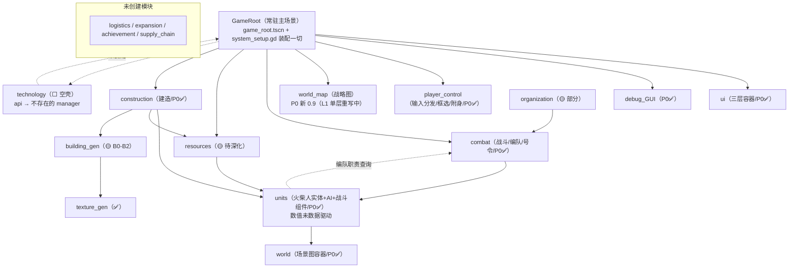

# 模块依赖关系总览（GDD ↔ 代码实证）

> **本文档定位**：以 GDD 设计意图为骨、实际代码为肉，逐系统梳理"谁依赖谁、谁实现了、谁缺什么"。
> 与 [`modules/README.md`](../../../stick-world/modules/README.md) §2 依赖图（模块视角速览）、[`数据流全景.md`](数据流全景.md)（数据流视角）、[`自动加载依赖.md`](自动加载依赖.md)（autoload 视角）互为补充——本文档是**实现状态与断链点**的权威索引。
> 本文档结论均来自对 `stick-world/` 实际代码的核查（2026-08），不是设计臆想。

---

## 一、顶层依赖图（实测）



**关键路径**：`GameRoot`（装配）→ `player_control`（输入）→ `combat`/`construction`/`resources`（玩法系统）→ `units`（执行）→ `world`（容器）。`organization` 是设计中的枢纽，实际仅被 `FormationSystem` 用于创建 L1 组织节点。

---

## 二、核心实体：GDD 定义 vs 代码实现

> GDD 实体清单见 `docs/技术/架构/核心实体与状态机.md`。

| GDD 实体 | 实际代码 | 实现状态 | 备注 |
|---|---|---|---|
| **Stickman** | `modules/units/scripts/stickman_entity.gd` + `HealthComponent` + `AIController` | ✅ 实体完整 | 数值**非数据驱动**：`max_hp=100`/`damage=12` 为 @export 硬编码，`config/units/stickmen.tres`（base_hp/base_attack，含 3 兵种）**无人读取**——所有火柴人同数值 |
| **Building** | `building_gen/`（BuildingDef 配方→节点树）+ `construction/`（生命周期） | 🟡 基础完整 | B0-B2 可用（仓库/城墙/兵营）；B3 模块系统/B4 多材质未做（阶段 1/2）；室内骨架有、内容无（阶段 1/2 随 B 系列深化） |
| **Organization** | `modules/organization/`（Manager + api） | 🟡 部分 | CRUD/标签(6种)/人事/层级调整完整；`load_preset` 未实现；树状层级 UI 未做（阶段 1） |
| **Project** | 仅 `construction_project.gd`（建造专用） | 🟡 专用 | 通用 Project 分解机制（GDD §组织）未实现；组织表的 `current_project` 字段无实际执行体 |
| **Battle** | `modules/combat/scripts/battle/battle_instance.gd` | ✅ 完整 | 阵营/伤亡统计/全灭判定/掩体/导演情绪标签全有；收敛体验（溃散表现/尸体处理）延后（P0-12） |
| **Region** | 字符串 `region_id`（全局占位 `"test_region"`） | ⬜ 未建模 | 无 Region 实体/地块归属/控制度（阶段 1 战略图接入后才有） |
| **Resource** | `modules/resources/`（manager + api） | 🟡 待深化 | 4 基础资源/库存/消耗/价格接口在；`_update_price`/`_tick_supply_demand`（供需模拟）TODO；无生产建筑接入 |
| **Technology** | `modules/technology/api.gd` | ⬜ 空壳 | api 转发到**不存在的 TechnologyManager**（scripts/ 空目录）；未被 GameRoot 装配，是孤儿文件 |
| **SupplyChain** | 无 | ⬜ 未创建 | 依赖 logistics 模块（未创建） |

---

## 三、模块全景（实现状态与断链）

### 3.1 已完整（P0 验收依赖）
| 模块 | GDD 定位 | 关键文件 | 依赖 | 被依赖 |
|---|---|---|---|---|
| **world** | 场景图容器/相机/加载 | `world/scripts/game_root.gd`、`scene_loader.gd`、`village_map.gd` | units（spawn 实体）、construction（注入） | 所有模块（装配中枢） |
| **units** | 火柴人实体+AI+战斗组件 | `stickman_entity.gd`、`ai_controller.gd`、8 个 behavior、`health_component.gd`、`weapon_mount.gd`、`hitbox.gd` | world（约束注入）、construction（派工查询）、combat（队伍职责查询→FormationSystem） | 全部玩法系统 |
| **combat** | 战斗实例+编队+号令+掩体+导演 | `battle_instance.gd`、`battle_director.gd`、`formation_system.gd`、`tactical_orders.gd`、`command_chain.gd`、`cover_system.gd`、`battle_ai_director.gd` | units（实体）、organization（L1 组织节点）、config/formations（编制预设） | GameRoot、ui（BattlePanel）、player_control |
| **construction** | 建造/拆除/修理 | `construction_manager.gd`、`construction_project.gd`、`work_crew_assigner.gd`、catalog/ | units（工人）、resources（扣资源）、world（placement_grid） | GameRoot、ui（BuildMenu） |
| **player_control** | 输入分发/框选/附身 | `input_dispatcher.gd`、`explore_handler.gd`、`selection_system.gd`（combat/）、`possession_interface.gd` | units、combat、world | GameRoot、ui |
| **ui** | 三层 UI 容器 | `ui_root.gd`、`mode_panel.gd`、`battle_panel.gd`、`formation_panel.gd`、`minimap.gd` | 各玩法系统 api（setup 注入） | GameRoot |
| **debug_GUI** | 调试覆盖层 | `api.gd` + drawers | world | 独立 |
| **texture_gen** | 程序化材质 | `procedural_materials.gd`、shaders | 无 | building_gen |

### 3.2 部分实现（🟡）
| 模块 | 已实现 | 缺口 |
|---|---|---|
| **organization** | 组织 CRUD/6 标签/层级/人事；被 FormationSystem 用作小队载体 | `load_preset`/`export_as_preset` 半成品；树状 UI；"组织驱动行为"（工程组织→建造、军事组织→战斗的自动映射）未做——现在只有玩家手动编队 |
| **resources** | 库存/消耗/转移/价格接口 + GameRoot 初始发放（300/300/100） | 供需价格模拟 TODO；资源产出（采集/生产建筑）未接入；未持久化（每次新游戏重置） |
| **building_gen** | BuildingDef 配方→节点树（仓库/城墙/兵营/占位）；材质 thatch/wood/stone | B3 模块系统、B4 多材质混合未做；**室内内容缺失**（见 §五-5） |
| **environment** | 时间→光照（CanvasModulate） | 天气/天空/震动未做 |
| **world_map（战略图）** | 纳入 **P0 新 0.9（L1 单层重写）**：只做玩家第一阶段世界图（8 城邦 + 随机地块 + 道路 + 卫星图底图 + 边界线着色，P 社索引图机制），跳过 L3/L2 粒度 | 旧三级粒度框架（granularity/mode/stitched/settlement_renderer）弃用；`api.initialize`/`close_strategic_map` 补齐；替换 `world_map_panel.gd` 占位（实施条目见待办事项.md 高优先级，技术方案见战略图架构 §10 SM-1'） |

### 3.3 空壳/未创建（⬜）
| 模块 | 状态 |
|---|---|
| **technology** | api.gd 转发到不存在 manager；未装配；GDD"征服获得科技"机制未实现 |
| **logistics / expansion / achievement / supply_chain** | 目录未创建（顶层 `modules/logistics` 是空目录残留） |

---

## 四、战斗链路特写（号令 → 死亡 → 胜负）

> 回应"血量/攻击系统是否做了"——逐环标注实测状态（2026-08 近战剑击版）。

```
① 玩家下达号令           TacticalOrders.issue → 校验小队战斗职责 ✅  [combat/tactical_orders.gd]
② 指挥链延迟             CommandChain.deliver（source_tier=0 延迟0）✅ [combat/command_chain.gd]
③ AI 覆盖决策            AIController.set_order → 状态机 travel ✅   [units/ai/ai_controller.gd]
④ 近战攻击行为           BehaviorAttack：寻最近敌→接近到剑长内→开火 ✅
⑤ 程序化挥砍             WeaponMount._play_swing：Tween 前摇-100°→挥出+30°→收招 ✅（无 K 帧）
⑥ 命中判定               距离80px + 命中率90%（情绪修正）✅
⑦ 扣血                    HealthComponent.take_damage：扣HP+扣士气 → died 信号 ✅
⑧ 物理受击反馈            apply_hit_reaction：击退冲量（衰减）+ 受击红闪 ✅
⑨ HitStop 顿帧           命中时 Engine.time_scale 冻结 0.06s（headless 禁用）✅
⑩ 死亡表现               StickmanEntity._on_died：停移/死亡动画/禁受击 ✅
⑪ 战斗统计与胜负         BattleInstance.on_unit_died → _check_victory 全灭判定 ✅
```

**结论**：血量系统（HP/士气/受伤/死亡/溃逃判定）与近战攻击系统（剑挂载/挥砍/射程/冷却/命中率/伤害/情绪修正）**数值与表现层均已实现**并被集成测试验证（`test_melee_combat` 5 用例：配剑/命中击退/距离/挥砍/冷却；`test_battle_lifecycle`：60s 内必须产生伤亡）。

**但仍有的边界**（后续迭代方向）：

| 缺口 | 现状 | 方向 |
|---|---|---|
| **攻击动作无 K 帧** | 挥砍是程序化 Tween（前摇→挥出→收招），身体无攻击姿态 | 用户后续 K 帧（attack.tres 目前 0.6s 空动画）或骨架程序化姿态 |
| **数值非数据驱动** | `stickmen.tres` 兵种数据无人读取；剑伤 15/范围 80 为 @export 硬编码 | 接入 BalanceConfig（读取器已就绪） |
| **受击反馈已基础** | ✅ 头顶血条 + 击退 + 红闪 + 顿帧（2026-08）；无受击后仰姿态/无命中粒子/无伤害数字 | 视觉层迭代 |
| **群体移动已基础** | ✅ 分离防叠人（soft-body 简化版，参考 Stick War Legacy clone）；无阵型/编队推进 | 米拉奇战纪式方阵推进为阶段 1 方向（见待办） |
| **装备/背包未做** | 临时配剑（所有火柴人同一把占位剑）；`weapons.tres`/`armors.tres` 未接入 | 见 §六 背包系统设计 |
| **无战斗收敛体验** | 全灭即结束（有）；溃散表现/尸体处理/战场退出后 AI 接管（P0-12 延后） | 待办事项低优先级 |

---

## 六、背包与装备系统（预留设计）

> 用户方向：当前"临时配剑"是过渡方案，后续需要完全版背包系统。本节梳理现有可复用基础 + 完全版设计要点，供阶段 1/2 实施时参考。

### 6.1 现有可复用基础（2026-08 实测）

| 资产 | 状态 | 说明 |
|---|---|---|
| `StickmanWeapon.attach`（units/scripts/weapons/） | ✅ | 武器挂载：GripPoint 握把对齐、双持（右手/左手）、渲染层级；**当前未被调用**（WeaponMount 改为直挂 innerhand marker） |
| `weapon_sword_placeholder.tscn` | ✅ | 占位剑场景（Sprite + GripPoint），临时配剑方案的基础 |
| `WeaponMount` | ✅ | 武器数据 + 攻击执行（伤害/射程/冷却/命中率）+ 程序化挥砍 + 受击反馈触发 |
| `config/units/weapons.tres` / `armors.tres` | ⬜ 未接入 | 装备数据表存在，无代码读取 |
| `config/units/stickmen.tres` | ⬜ 未接入 | 兵种属性（base_hp/base_attack/base_speed）——装备加成的基数，**须先做数值数据驱动** |
| `BalanceConfig`（autoload） | ✅ 读取器就绪 | 按类型路径读 .tres，接入点现成 |

### 6.2 完全版设计要点（分期）

```
P1 基础背包（依赖：数值数据驱动先行）
  inventory 模块（新）：InventoryComponent（容量/堆叠/物品 def 引用）
  → units：实体挂背包组件；装备槽（武器槽/护甲槽/工具槽）
  → 装备生效：weapon def → WeaponMount 数值覆盖（伤害/射程/冷却/挥砍速度）
  → UI：背包/装备面板（ui 模块 ModalOverlay 系，参照 FormationPanel）

P2 物品生态（依赖：resources/经济）
  掉落（敌人死亡掉落）、采集产出、合成（加工品 → 铁匠铺制作）
  物品 def 表：config/items/*.tres（对齐 GDD §2.2 加工品/奢侈品待补充后激活）

武器类型差异（依赖：攻击行为数据驱动）
  剑/斧 = 近战挥砍（现有 BehaviorAttack + WeaponMount 程序化挥砍）
  弓/弩 = 远程弹道（新：投射物 + 飞行 + 命中）——需扩展 combat 或 units
```

### 6.3 依赖关系（目标态）

```
inventory（新模块）
├── 依赖：units（挂组件）、balance_config（物品 def）、ui（面板）
├── 被依赖：combat（武器属性 → WeaponMount）、construction（工具加成）
└── 边界：不持有玩法逻辑，只做"拥有/取用/装备"；掉落/合成由玩法系统调用其 API
```

---

## 五、断链点与依赖断裂（按优先级）

| # | 断裂 | 表现 | 修复前置 |
|---|---|---|---|
| 1 | **technology：api → 不存在的 manager** | 模块不可用；GDD 科技系统全缺 | 阶段 1：按 04-科技系统.md 建 TechnologyManager（征服制） |
| 2 | **world_map 未挂载** | 战略图（Tab/大世界）是占位按钮面板 | **P0 新 0.9 处理中**（L1 单层重写 + 接线，见待办事项.md） |
| 3 | **数值数据驱动断裂**：config/units/*.tres ↔ StickmanEntity | 兵种无差异、平衡表失效 | BalanceConfig autoload 已存在（读取器就绪），需接入实体 + 战斗组件 |
| 4 | **战斗无可感知性**：伤害链路 ✅ 但无 UI 反馈 | 血条/伤害数字/受击表现缺失 | ui 模块 + visual_controller 扩展 |
| 5 | **室内断裂**：building def interior_mode=0、无室内内容、mega_interior 孤岛、零测试 | 原型循环验收不含"室内"环节 | 阶段 1/2 随建筑模块化 B 系列深化 |
| 6 | **resources 供需未接入** | 经济系统无循环 | `_update_price`/`_tick_supply_demand` TODO 实现 + 生产建筑接入 |
| 7 | **组织不驱动行为** | 组织只是数据容器，不自动派活 | 阶段 1 组织系统深化（load_preset/任务分解） |
| 8 | **跨图携带只覆盖编队** | NPC 村民不随行（设计如此 P0）；存档不含编队 | 存档扩展（P1） |

---

## 七、测试套件 ↔ 验证链路（证据索引）

> 全量运行：`powershell -File tests/run_all.ps1`（25 套件：unit 6 + integration 17 + smoke 2，2026-08 实测全绿）

| 套件 | 类型 | 验证的依赖链路 |
|---|---|---|
| test_game_root_assembly | integration | GameRoot → SystemSetup 全装配 |
| test_village_map | integration | world → placement_grid → camera_rig → debug |
| test_ai_behaviors | integration | units：AIController → 8 行为 → 实体移动 |
| test_construction_cycle | integration | construction → units（派工）→ resources（扣费）→ building_gen |
| test_battle_lifecycle | integration | combat → units：战斗启动 → 伤亡 → attack 行为 |
| test_selection_formation / test_formation_system / test_tactical_orders / test_battle_ui | integration/unit | player_control ↔ combat：框选 → 编队 → 号令 → 指挥链 |
| test_formation_presets | integration | combat → organization → config/formations：预设/职责过滤/号令拒绝 |
| test_squad_travel | integration | **带队出征**：combat（编队快照）↔ world（跨图）↔ combat（战场重建+遭遇战） |
| test_melee_combat | integration | **近战剑击**：配剑挂载 → 命中扣血击退 → 距离判定 → 挥砍旋转 → 冷却 |
| test_possession | integration | player_control → units：附身链路 |
| test_cross_map_travel | smoke | world：SceneLoader 多图切换 + ChunkTrigger |
| test_new_game_smoke | smoke | 完整启动链路 60s 零崩溃 |
| unit/（6 套件） | unit | 各系统纯逻辑：Health/资源/指挥链/编队/状态机/网格 |

**未被任何测试覆盖**：technology、world_map（P0 新 0.9 将补 test_strategic_map_p0）、resources 供需、室内、数值数据驱动、血条视觉。

---

## 八、与其他文档的关系

| 文档 | 分工 |
|---|---|
| [`modules/README.md`](../../../stick-world/modules/README.md) | 模块速查表 + 代码级依赖图（开发导航） |
| [`数据流全景.md`](数据流全景.md) | 数据如何流动（命令下发/经济调节/信息上报） |
| [`模块API契约.md`](模块API契约.md) | 各模块 api.gd 签名契约 |
| [`自动加载依赖.md`](自动加载依赖.md) | autoload 单例依赖与初始化顺序 |
| **本文档** | **实现状态真相 + 断链点索引**（GDD↔代码对照） |
