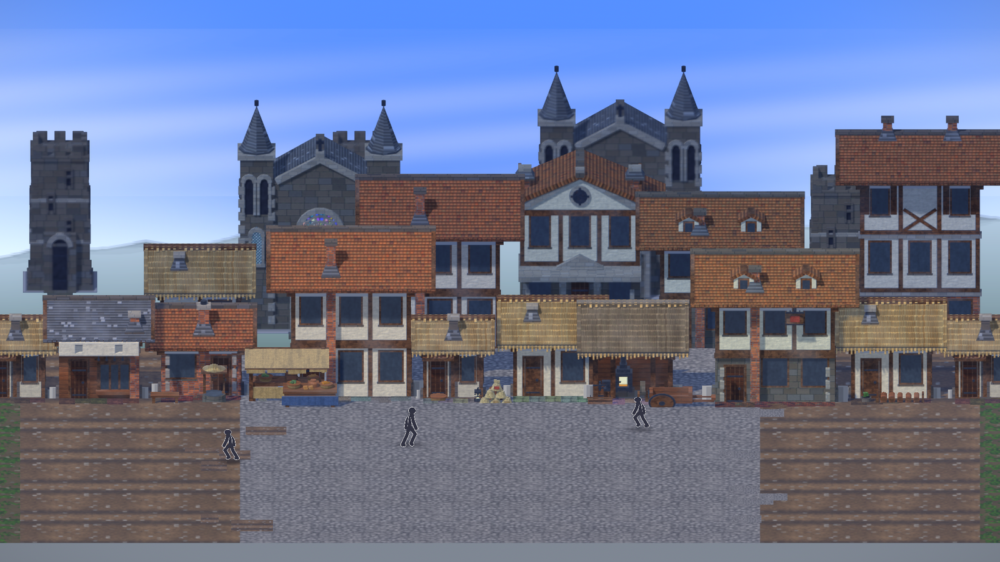

# HD-2D 坐标投影收编

> 悬浮/选中/缩放等指示器从 2D 画布域收编进 HD-2D 投影域——火柴人随身视觉从此只有一个坐标真相源。

- **根因修复**：悬浮方框曾工作在 2D 画布域（绘制锚是 2D 行走带原点），与 HD-2D billboard 投影位置脱节，方框飘在角色实际位置上方很远处
- **收编范围**：hover 指示、选中框（全身包裹）、缩放条整 10 档、摆件碰撞带（贴脚线 + 方向修正）、origin 空间碰撞箱
- 交付后 HD-2D 域内指示器行为一致，2D 域旧链路退役

入口：[归档交接档](../../项目/交接/归档/HD-2D坐标投影收编-进度与交接.md)、[场景宿主架构](../../技术/架构/场景与战斗/场景宿主架构.md)
