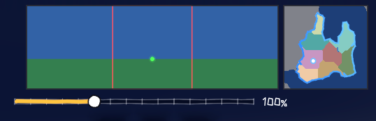

# 战略图基础与世界生成 V1

> 鸟瞰多边形领土的战略图（world_map，玩家不在其中）与喂它的第一代世界生成链。

- **世界生成 V1**：分形大陆高程、河流网络、Delaunay 邻接——产物经数据流契约喂给战略图
- **战略图 L1**：地块/大陆两级视图（Tab/M 切换），地形与政治两种模式
- **小地图**：场景图内的鸟瞰定位图

入口：[战略图架构](../技术/架构/战略图架构.md)、[世界地图数据流](../技术/架构/世界地图数据流.md)、[程序化世界生成](../设计/系统/08-程序化世界生成.md)
