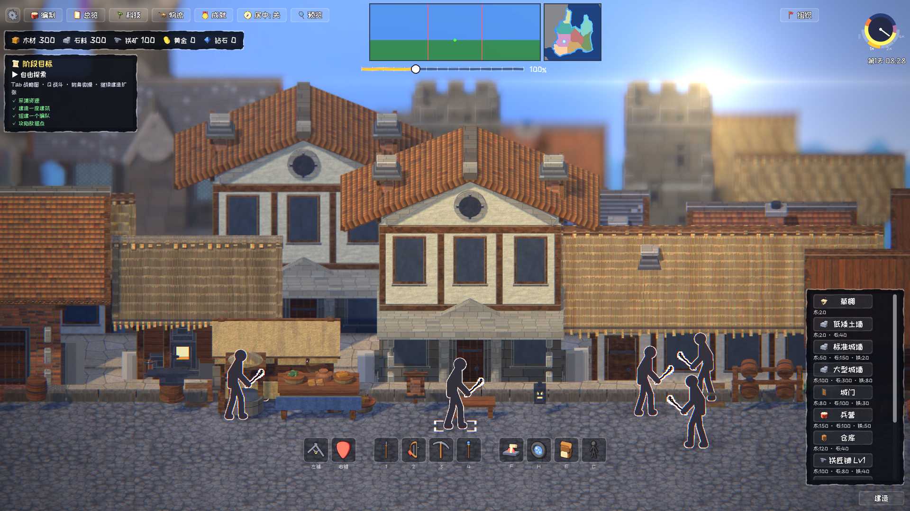
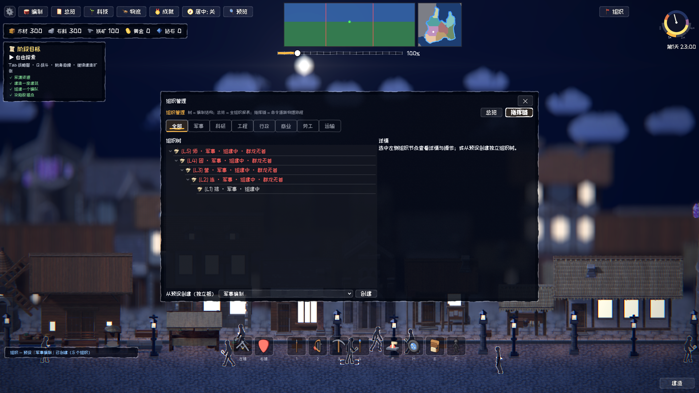
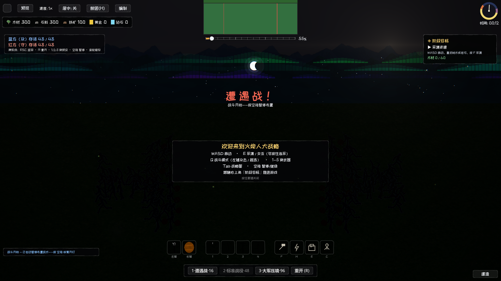
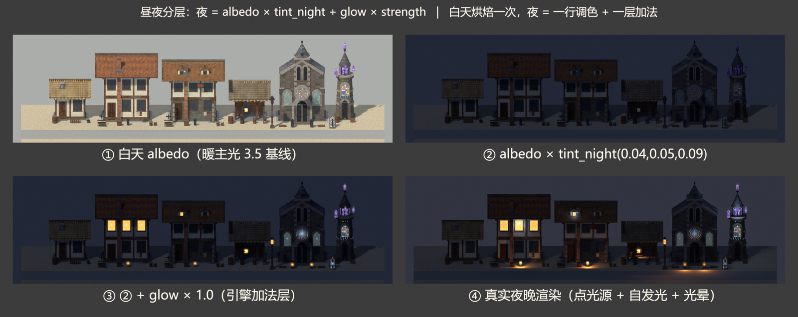

# 演示闭环与天空氛围

> 第一个可玩原型串成的 10 分钟闭环（v0.5 已打包发布）：采集 → 建造 → 编队 → 战斗四阶段引导，胜利结算后开放自由沙盒。

- **四阶段目标卡**：全事件驱动零轮询（监听资源/建造/编队/战斗四路信号），胜利结算含用时与统计
- **士兵 AI**：Running with Rifles 式参数档案——侧翼自动包抄、站桩微移步、受击规避小跳
- **天空生命感**：夜空星野（380 颗 + 大星十字 sparkle）、月亮双层光晕、白昼剪影飞鸟群（会被山脊遮挡出纵深）、近地萤火虫短脉冲——与后处理共用同一昼夜因子
- **全屏后处理**：单 pass 六层（暖色分级/太阳炫光/渐晕/边缘色差/胶片颗粒），昼夜联动
- **程序化主菜单背景**：黄金时刻渐变 + 远山 + 漂移云

入口：[游戏设计文档](../设计/游戏设计文档.md)、[场景与战斗架构](../技术/架构/场景与战斗架构.md)
